---
## Author
author:
  name: Соколова Александра Олеговна
  degrees: DSc
  orcid: 0000-0002-0877-7063
  email: 1132236034s@rudn.ru
  affiliation:
    - name: Российский университет дружбы народов
      country: Российская Федерация
      postal-code: 117198
      city: Москва
      address: ул. Миклухо-Маклая, д. 6
## Title
title: Презентация по лабораторной работе №1
subtitle: Математическое моделирование
license: CC BY
date: today
date-format: "YYYY-MM-DD" # Example: 2025-09-06
---

## Цель работы

Подготовить рабочее пространство для выполнения лабораторных работ. Освоить основные принципы математического моделирования на примере модели экспоненциального роста, а также научиться работать с инструментами, используемыми в курсе: системой контроля версий Git, пакетом DrWatson для организации научных проектов в Julia и литературным программированием с использованием Literate.jl.

## Базовая настройка git

Подготавливаем рабочее пространство. Выполним базовую настройку git. Зададим имя и email владельца репозитория. Настроим utf-8 в выводе сообщений git. Настроим верификацию и подписание коммитов git. Зададим имя начальной ветки (будем называть её master). Настроим параметры autocrlf и safecrlf ([рис. @fig-001]).

{#fig-001 width=70%}

## Создание SSH ключа

Создаем учетную запись на github (была создана ранее) и создаем ключ для доступа к github ([рис. @fig-002]).

{#fig-002 width=70%}

## Создание SSH ключа

Добавляем ключ в агент ([рис. @fig-003]).

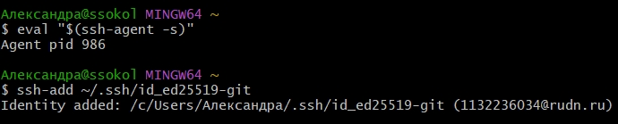{#fig-003 width=70%}

## Создание SSH ключа

Выводим ключ на экран ([рис. @fig-004]).

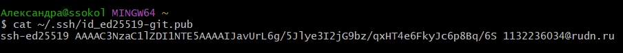{#fig-004 width=70%}

## Создание SSH ключа

Добавляем ключ в учетную запись через web-интерфейс ([рис. @fig-005]).

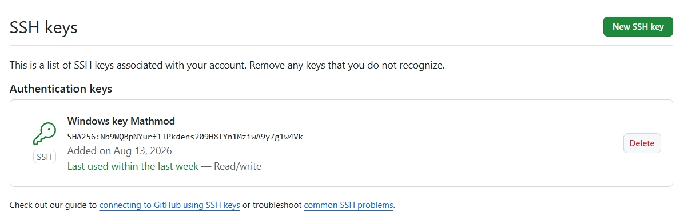{#fig-005 width=70%}

## Создание PGP ключей

Создаем ключи PGP. При создании выбираем предложенные опции, которые указаны в методичке ([рис. @fig-006]).

{#fig-006 width=70%}

## Добавление PGP ключа на хостинг

Для добавления PGP ключа на хостинг выводим список ключей и копируем отпечаток приватного ключа ([рис. @fig-007]).

{#fig-007 width=70%}

## Добавление PGP ключа на хостинг

Копируем сгенерированный PGP ключ в буфер обмена ([рис. @fig-008]).

{#fig-008 width=70%}

## Добавление PGP ключа на хостинг

Добавляем ключ в учетную запись через web-интерфейс ([рис. @fig-009]).

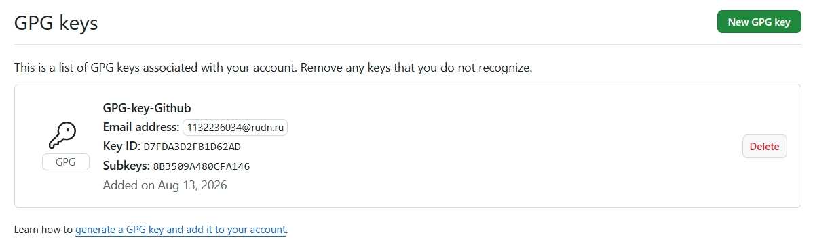{#fig-009 width=70%}

## Настройка автоматических подписей коммитов git

Делаем настройку автоматических подписей коммитов git. Используя введёный email, указываем Git применять его при подписи коммитов ([рис. @fig-010]).

{#fig-010 width=70%}

## Создание рабочего пространства лабораторной работы

Создаю репозторий на основе шаблона курса ([рис. @fig-011]).

{#fig-011 width=70%}

## Создание рабочего пространства лабораторной работы

Клонирую созданный репозиторий ([рис. @fig-012]).

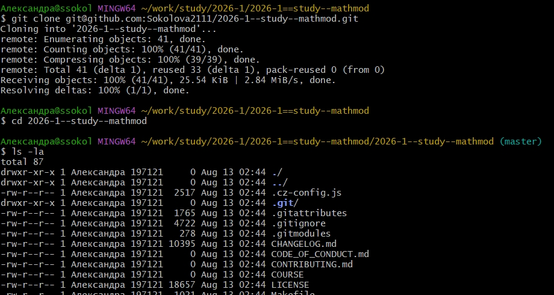{#fig-012 width=70%}

## Создание рабочего пространства лабораторной работы

Выполняю настройу каталога курса. Перехожу в каталог курса и инициализирую курс, а затем отправляю файлы на сервер ([рис. @fig-013]).

{#fig-013 width=70%}

## Создание рабочего пространства лабораторной работы

Настраиваю конфигурацию git-flow. Для начала инициализируем git-flow. Префикс для ярлыков установливаю в v ([рис. @fig-014]).

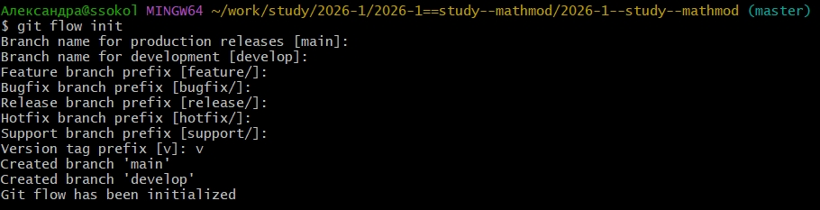{#fig-014 width=70%}

## Создание рабочего пространства лабораторной работы

Проверяю, что я нахожусь на ветке develop и загружаю весь репозиторий в хранилище ([рис. @fig-015]).

{#fig-015 width=70%}

## Создание рабочего пространства лабораторной работы

Создаю релиз с версией 1.0.0. Создаю журнал изменений и добавляю его в индекс ([рис. @fig-016]).

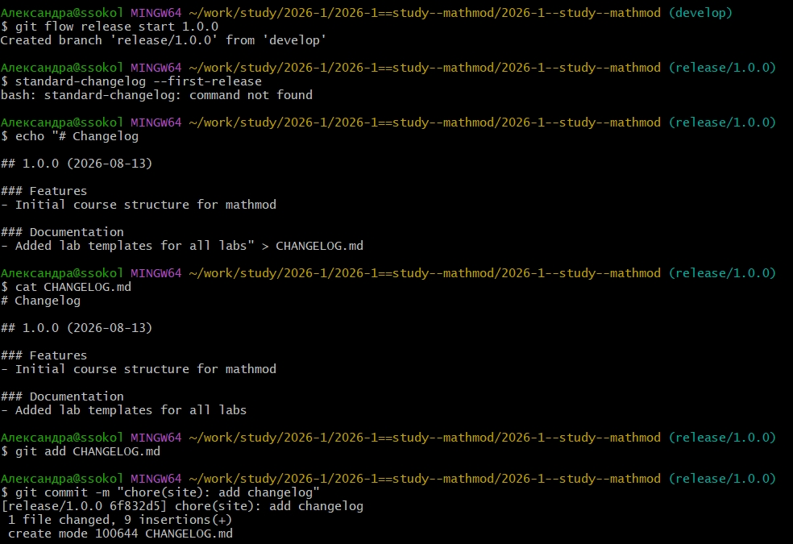{#fig-016 width=70%}

## Создание рабочего пространства лабораторной работы

Заливаю релизную ветку в основную ветку и отправляю данные на github ([рис. @fig-017]).

{#fig-017 width=70%}

## Создание рабочего пространства лабораторной работы

Копирую CHANGELOG.md в каталог release ([рис. @fig-018]).

{#fig-018 width=70%}

## Создание рабочего пространства лабораторной работы

Создаем релиз с помощью утилиты работы с github ([рис. @fig-019]).

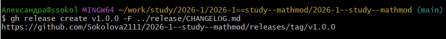{#fig-019 width=70%}

## Создание проекта DrWatson для лабораторных

Создаю каталог проекта DrWatson. Делать это я буду через REPL Julia. Открываю терминал, запускаю Julia и в REPL выполняю команды, отображенные на скриншоте ([рис. @fig-020]).

{#fig-020 width=70%}

## Добавление необходимых пакетов

Добавляю необходимые пакеты. Делать я это буду с помощью поэтапной установки в REPL. Активирую проект и с помощью "Pkg.add" устанавливаю основные пакеты ([рис. @fig-021]).

{#fig-021 width=70%}

## Проверка установки

Для проверки установки создаю тестовый скрипт scripts/test_setup.jl ([рис. @fig-022]).

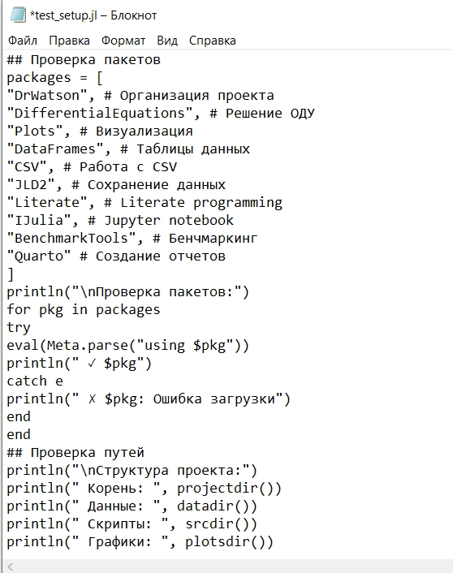{#fig-022 width=70%}

## Проверка установки

Запускаю тестовый скрипт ([рис. @fig-023]).

{#fig-023 width=70%}

## Модель экспоненциального роста

Создаю следующий скрипт (scripts/01_exponential_growth.jl) для реализации модели экспоненциального роста ([рис. @fig-024]).

{#fig-024 width=70%}

## Модель экспоненциального роста

Запускаю скрипт ([рис. @fig-025]).

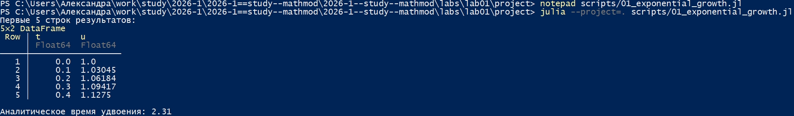{#fig-025 width=70%}

## Модель экспоненциального роста

Просматриваю результирующий график в каталоге plots/ ([рис. @fig-026]).

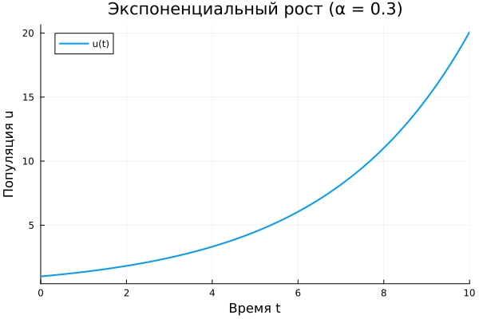{#fig-026 width=70%}

## Модель экспоненциального роста

Для литературной реализации модели добавляю в файл 01_exponential_growth.jl описание в духе литературного программирования ([рис. @fig-027]).

{#fig-027 width=70%}

## Модель экспоненциального роста

Выполняю програмный код, проверяю полученные данные и графики ([рис. @fig-028]).

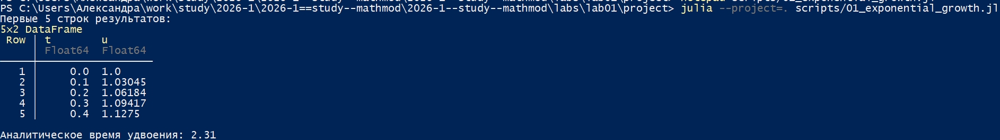{#fig-028 width=70%}

## Модель экспоненциального роста

Создаю скрипт для генерации производных форматов (scripts/tangle.jl) ([рис. @fig-029]).

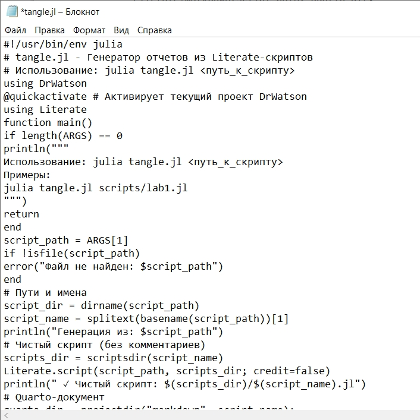{#fig-029 width=70%}

## Модель экспоненциального роста

Генерируем чистый код, jupyter notebook и документацию в формате Quarto с помощью tangle.jl ([рис. @fig-030]).

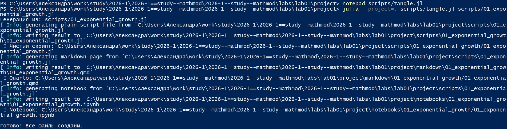{#fig-030 width=70%}

## Модель экспоненциального роста

Открываем jupyter notebook и проверяем что все коды успешно запускаются ([рис. @fig-031]).

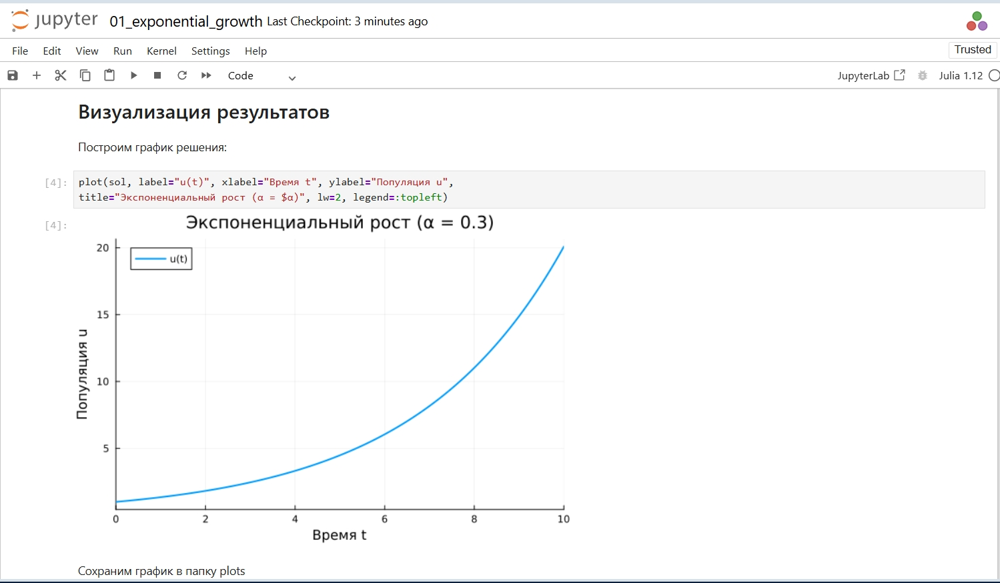{#fig-031 width=70%}

## Документирование в отчёте

В каталоге отчёта в файл _quarto.yml включаю поддержку кода julia ([рис. @fig-032).

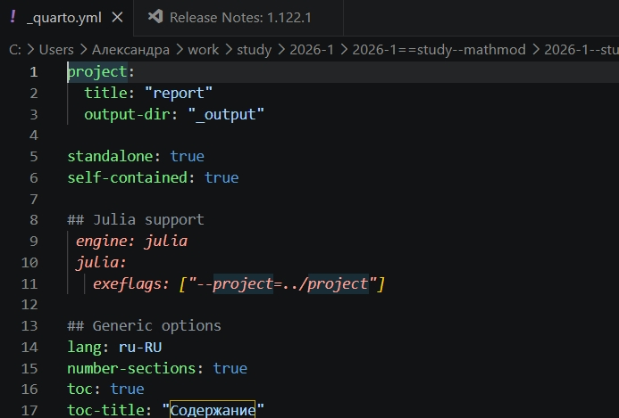{#fig-032 width=70%} 

## Документирование в отчёте

В преамбуле preamble.tex подключаю пакет juliamono ([рис. @fig-033).

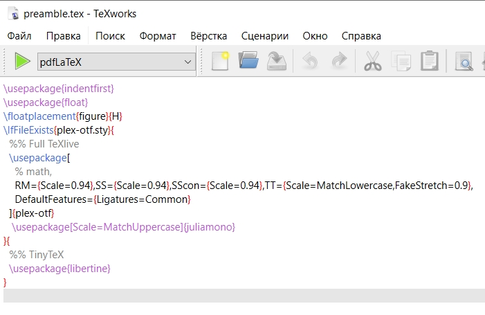{#fig-033 width=70%} 

## Документирование в отчёте

В файле отчёта после описания выполнения лабораторной работы подключаю файл описания программы ([рис. @fig-034).

{#fig-034 width=70%}

## Реализация модели с параметрами 

Для реализации модели с параметрами создаю файл scripts/02_exponential_growth.lj и переношу туда код из методички ([рис. @fig-035).

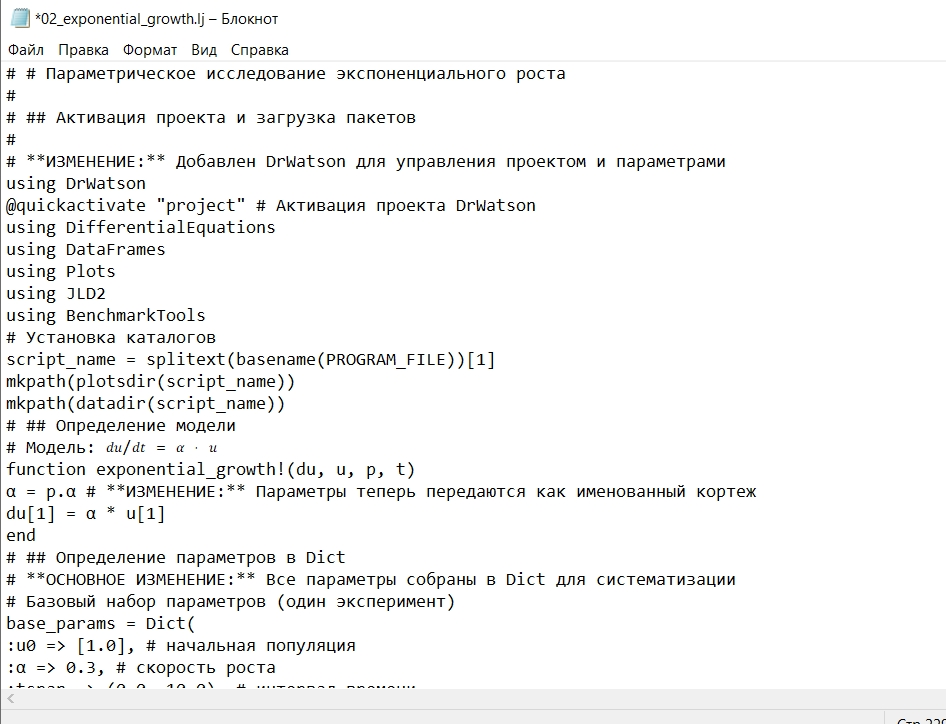{#fig-035 width=70%}

## Реализация модели с параметрами

Выполняем программу ([рис. @fig-036).

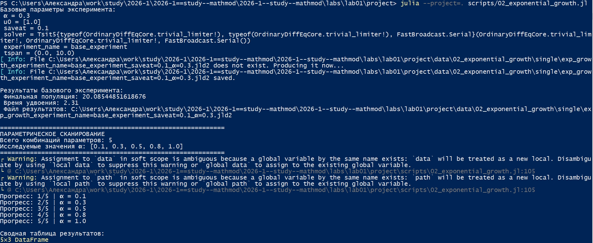{#fig-036 width=70%}

## Реализация модели с параметрами

Генерируем чистый код, jupyter notebook и документацию в формате Quarto с помощью tangle.jl ([рис. @fig-037]).

{#fig-037 width=70%}

## Реализация модели с параметрами

Открываем jupyter notebook и проверяем что все коды успешно запускаются ([рис. @fig-038]).

{#fig-038 width=70%}

## Выводы

Таким образом, в ходе работы был освоен полный цикл математического моделирования: от постановки задачи и формализации до численной реализации, параметрического исследования и оформления результатов с использованием современных инструментов для воспроизводимых научных вычислений.
