---
## Author
author:
  name: Соколова Александра Олеговна
  degrees: DSc
  orcid: 0000-0002-0877-7063
  email: 1132236034@rudn.ru
  affiliation:
    - name: Российский университет дружбы народов
      country: Российская Федерация
      postal-code: 117198
      city: Москва
      address: ул. Миклухо-Маклая, д. 6

## Title
title: "Отчёт по лабораторной работе №1"
subtitle: "Математическое моделирование"
license: "CC BY"
---

# Цель работы

Подготовить рабочее пространство для выполнения лабораторных работ. Освоить основные принципы математического моделирования на примере модели экспоненциального роста, а также научиться работать с инструментами, используемыми в курсе: системой контроля версий Git, пакетом DrWatson для организации научных проектов в Julia и литературным программированием с использованием Literate.jl.

# Задание

— Создать рабочий каталог для всего курса.

— Создать рабочее пространство для программ в рамках лабораторной работы.

— Выполнить все задания по тексту лабораторной работы.

— Установить необходимые пакеты.

— Выполнить предложенный код.

— Преобразовать код в литературный стиль.

— Сгенерировать из литературного кода:

— чистый код;

— jupyter notebook;

— документацию в формате Quarto.

— Выполнить код из jupyter notebook.

— Интегрировать документацию в формате Quarto в отчёт.

— Добавить в код в литературном стиле вычисление для набора параметров.

— Сгенерировать из литературного кода с параметрами:

— чистый код;

— jupyter notebook;

— документацию в формате Quarto.

— Выполнить код из jupyter notebook с параметрами.

— Интегрировать документацию с параметрами в формате Quarto в отчёт.

# Теоретическое введение

## Системы контроля версий

Системы контроля версий (Version Control System, VCS) применяются при работе нескольких человек над одним проектом. Основное дерево проекта хранится в локальном или удалённом репозитории. При внесении изменений система контроля версий позволяет их фиксировать, совмещать изменения, произведённые разными участниками, а также производить откат к любой более ранней версии проекта.

В классических системах контроля версий используется централизованная модель, предполагающая наличие единого репозитория. В распределённых системах, таких как Git, центральный репозиторий не является обязательным.

Git — распределённая система контроля версий, представляющая собой набор программ командной строки. Благодаря распределённой архитектуре резервную копию локального хранилища можно сделать простым копированием или архивацией.

Основные команды Git включают: `git init` (создание репозитория), `git pull` (получение обновлений), `git push` (отправка изменений), `git status` (просмотр изменённых файлов), `git add` (добавление файлов в индекс), `git commit` (сохранение изменений).

## Модель ветвления Git Flow

Git Flow предполагает выстраивание строгой модели ветвления с учётом выпуска проекта. В рамках этого процесса используются две основные ветки: `master` (хранит официальную историю релиза) и `develop` (предназначена для объединения всех функций). Кроме того, создаются функциональные ветки (`feature`), ветки выпуска (`release`) и ветки исправлений (`hotfix`).

Последовательность действий при работе по модели Git Flow:

- Из ветки `master` создаётся ветка `develop`.
- Из ветки `develop` создаются ветки `feature` и `release`.
- Когда работа над веткой `feature` завершена, она сливается с веткой `develop`.
- Когда работа над веткой релиза `release` завершена, она сливается в ветки `develop` и `master`.
- Если в `master` обнаружена проблема, из `master` создаётся ветка `hotfix`.
- Когда работа над веткой исправления `hotfix` завершена, она сливается в ветки `develop` и `master`.

## Семантическое версионирование

Семантическое версионирование — подход к версионированию программного обеспечения, описываемый в манифесте семантического версионирования. Версия задаётся в виде кортежа МАЖОРНАЯ_ВЕРСИЯ.МИНОРНАЯ_ВЕРСИЯ.ПАТЧ. Номер версии следует увеличивать:
- МАЖОРНУЮ версию — когда сделаны обратно несовместимые изменения API.
- МИНОРНУЮ версию — когда добавляется новая функциональность, не нарушающая обратной совместимости.
- ПАТЧ-версию — когда делаются обратно совместимые исправления.

## Общепринятые коммиты

Спецификация Conventional Commits — соглашение о том, как нужно писать сообщения коммитов. Совместимо с SemVer и регламентирует структуру и основные типы коммитов.

Структура коммита:

<тип>(<область>): <описание изменения>

[необязательное тело]

[необязательный нижний колонтитул]

Базовые типы коммитов:
- `fix:` — исправляет ошибку (соответствует PATCH в SemVer).
- `feat:` — добавляет новую функцию (соответствует MINOR в SemVer).
- `BREAKING CHANGE:` — добавляет изменения, нарушающие обратную совместимость (соответствует MAJOR в SemVer).
- `revert:` — отменяет предыдущую фиксацию.

## Литературное программирование

Литературное (грамотное) программирование — подход, приоритизирующий понятность программы для человека, а не её исполнение компьютером. Идея, предложенная Дональдом Кнутом, меняет традиционный взгляд: программа создаётся не как последовательность инструкций для машины, а как литературное эссе, объясняющее логику решения задачи.

Автор представляет программу как сеть взаимосвязанных идей, располагая фрагменты кода в логическом для человеческого понимания порядке. Для работы с таким исходником нужны две утилиты: `weave` — «плетёт» документ для чтения, и `tangle` — «запутывает» из фрагментов исполняемый исходный код.

## DrWatson

DrWatson.jl — фреймворк для организации научных проектов в Julia. Предоставляет стандартные пути для данных, скриптов и результатов, автоматическое сохранение и загрузку данных, а также инструменты для воспроизводимости экспериментов.

Создаваемая структура проекта включает:
- `Project.toml` и `Manifest.toml` — файлы окружения.
- `data/` — для хранения данных.
- `sims/` — результаты симуляций.
- `scripts/` — скрипты для анализа.
- `src/` — исходный код проекта.

## Модель экспоненциального роста

Экспоненциальный рост — процесс увеличения величины, при котором скорость роста в каждый момент времени пропорциональна текущему значению этой величины.

Дифференциальное уравнение модели:
$$\frac{du}{dt} = \alpha u$$

где:
- $u$ — текущее значение растущей величины (численность популяции, капитал, количество заражённых и т.д.);
- $t$ — время;
- $\alpha$ — константа роста (мальтузианский параметр).

Решение уравнения:
$$u(t) = u_0 e^{\alpha t}$$

Ключевая характеристика — постоянное время удвоения:
$$T_2 = \frac{\ln(2)}{\alpha} \approx \frac{0.693}{\alpha}$$

Модель применяется в биологии (рост популяций), финансах (сложный процент), эпидемиологии, демографии, физике и информационных технологиях.

Ограничение модели: экспоненциальный рост не может продолжаться бесконечно из-за ограниченности ресурсов.

# Выполнение лабораторной работы

## Настройка git

Подготавливаем рабочее пространство. Выполним базовую настройку git. Зададим имя и email владельца репозитория. Настроим utf-8 в выводе сообщений git. Настроим верификацию и подписание коммитов git. Зададим имя начальной ветки (будем называть её master). Настроим параметры autocrlf и safecrlf ([рис. @fig-001]).

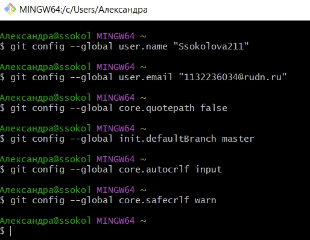{#fig-001 width=70%}

Создаем учетную запись на github (была создана ранее) и создаем ключ для доступа к github ([рис. @fig-002]).

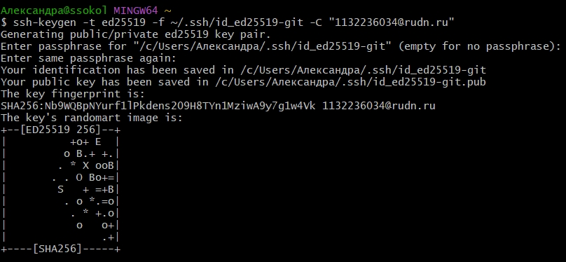{#fig-002 width=70%}

Добавляем ключ в агент ([рис. @fig-003]).

{#fig-003 width=70%}

Выводим ключ на экран ([рис. @fig-004]).

{#fig-004 width=70%}

Добавляем ключ в учетную запись через web-интерфейс ([рис. @fig-005]).

{#fig-005 width=70%}

Создаем ключ PGP. При создании выбираем предложенные опции, которые указаны в методичке ([рис. @fig-006]).

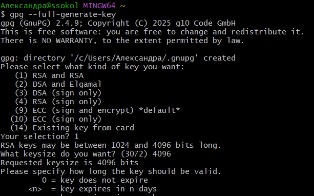{#fig-006 width=70%}

Для добавления PGP ключа на хостинг выводим список ключей и копируем отпечаток приватного ключа ([рис. @fig-007]).

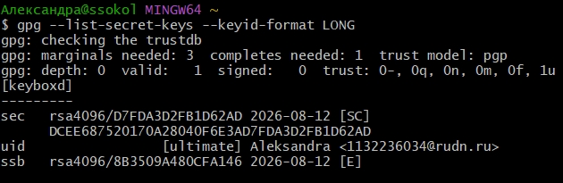{#fig-007 width=70%}

Копируем сгенерированный PGP ключ в буфер обмена ([рис. @fig-008]).

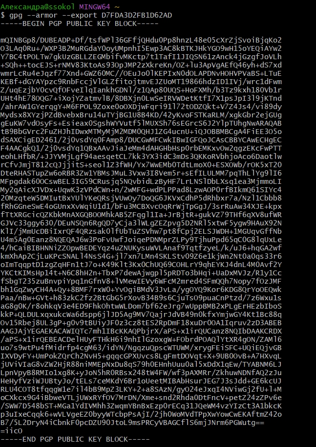{#fig-008 width=70%}

Добавляем ключ в учетную запись через web-интерфейс ([рис. @fig-009]).

{#fig-009 width=70%}

Делаем настройку автоматических подписей коммитов git. Используя введёный email, указываем Git применять его при подписи коммитов ([рис. @fig-010]).

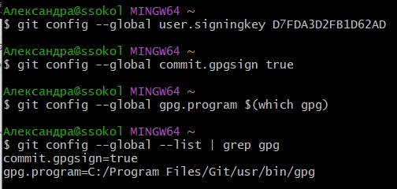{#fig-010 width=70%}

## Рабочее пространство лабораторной работы

Создаю репозторий на основе шаблона курса ([рис. @fig-011]).

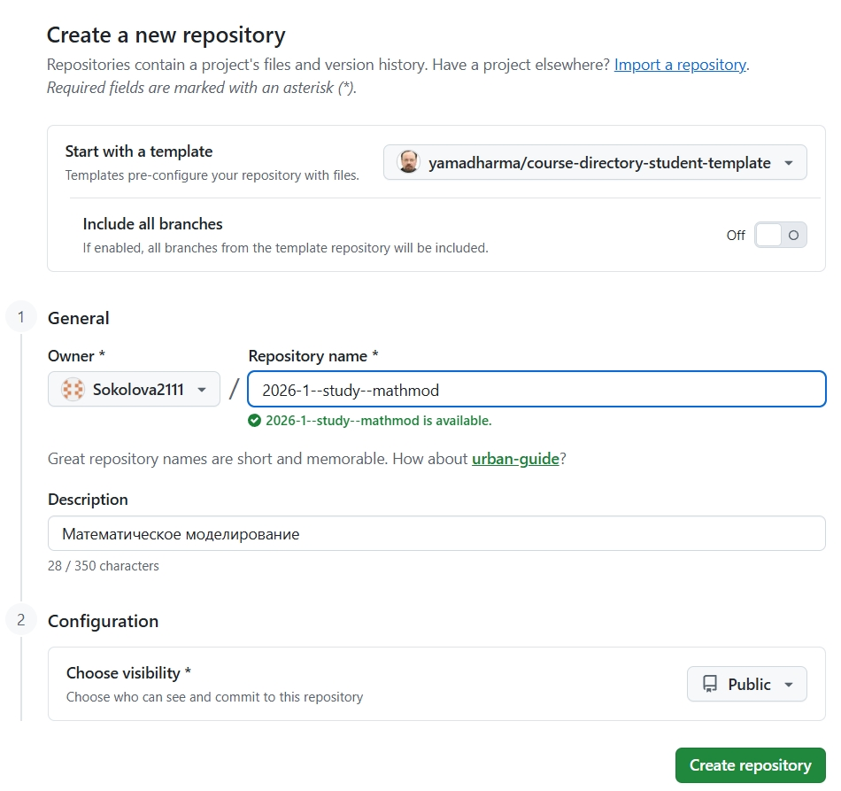{#fig-011 width=70%}

Клонирую созданный репозиторий ([рис. @fig-012]).

{#fig-012 width=70%}

Выполняю настройу каталога курса. Перехожу в каталог курса и инициализирую курс, а затем отправляю файлы на сервер ([рис. @fig-013]).

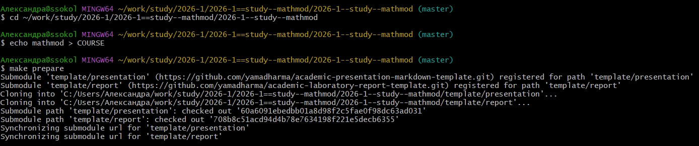{#fig-013 width=70%}

Настраиваю конфигурацию git-flow. Для начала инициализируем git-flow. Префикс для ярлыков установливаю в v ([рис. @fig-014]).

{#fig-014 width=70%}

Проверяю, что я нахожусь на ветке develop и загружаю весь репозиторий в хранилище ([рис. @fig-015]).

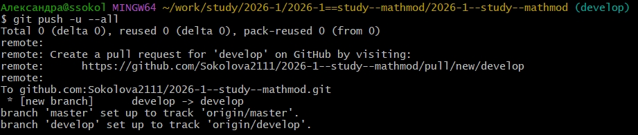{#fig-015 width=70%}

Создаю релиз с версией 1.0.0. Создаю журнал изменений и добавляю его в индекс ([рис. @fig-016]).

{#fig-016 width=70%}

Заливаю релизную ветку в основную ветку и отправляю данные на github ([рис. @fig-017]).

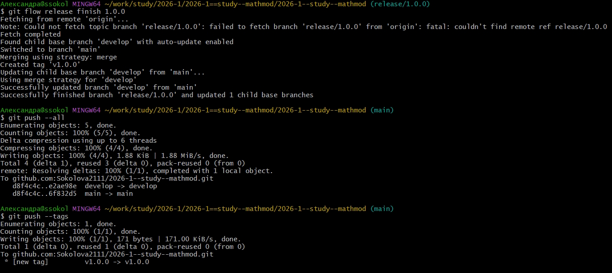{#fig-017 width=70%}

Копирую CHANGELOG.md в каталог release ([рис. @fig-018]).

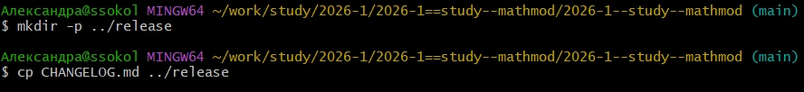{#fig-018 width=70%}

Создаем релиз с помощью утилиты работы с github ([рис. @fig-019]).

{#fig-019 width=70%}

## Создание проекта DrWatson для лабораторных

Создаю каталог проекта DrWatson. Делать это я буду через REPL Julia. Открываю терминал, запускаю Julia и в REPL выполняю команды, отображенные на скриншоте ([рис. @fig-020]).

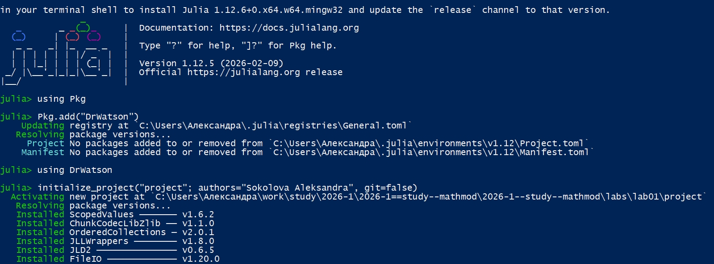{#fig-020 width=70%}

Добавляю необходимые пакеты. Делать я это буду с помощью поэтапной установки в REPL. Активирую проект и с помощью "Pkg.add" устанавливаю основные пакеты ([рис. @fig-021]).

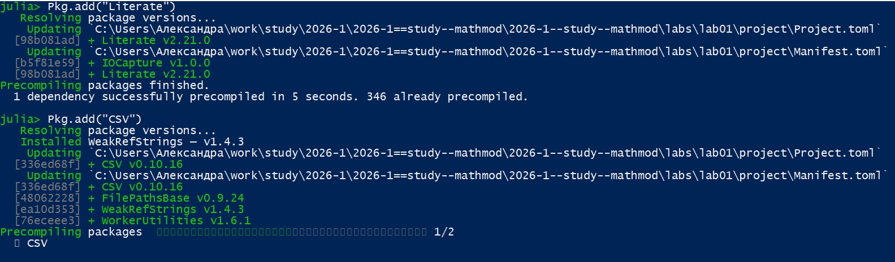{#fig-021 width=70%}

Для проверки установки создаю тестовый скрипт scripts/test_setup.jl ([рис. @fig-022]).

{#fig-022 width=70%}

Запускаю тестовый скрипт ([рис. @fig-023]).

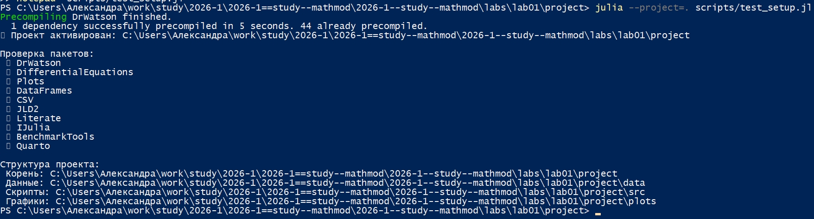{#fig-023 width=70%}

## Модель экспоненциального роста

Создаю следующий скрипт (scripts/01_exponential_growth.jl) для реализации модели экспоненциального роста ([рис. @fig-024]).

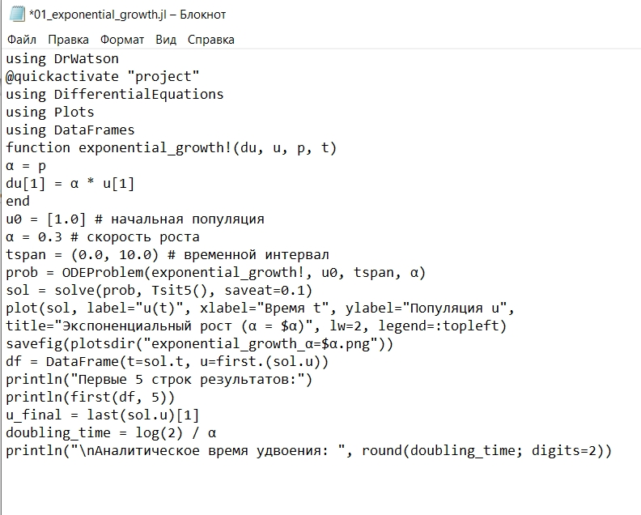{#fig-024 width=70%}

Запускаю скрипт ([рис. @fig-025]).

{#fig-025 width=70%}

Просматриваю результирующий график в каталоге plots/ ([рис. @fig-026]).

{#fig-026 width=70%}

Для литературной реализации модели добавляю в файл 01_exponential_growth.jl описание в духе литературного программирования ([рис. @fig-027]).

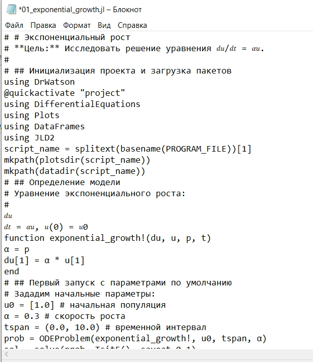{#fig-027 width=70%}

Выполняю програмный код, проверяю полученные данные и графики ([рис. @fig-028]).

{#fig-028 width=70%}

Создаю скрипт для генерации производных форматов (scripts/tangle.jl) ([рис. @fig-029]).

{#fig-029 width=70%}

Генерируем чистый код, jupyter notebook и документацию в формате Quarto с помощью tangle.jl ([рис. @fig-030]).

{#fig-030 width=70%}

Открываем jupyter notebook и проверяем что все коды успешно запускаются ([рис. @fig-031]).

{#fig-031 width=70%} 

В каталоге отчёта в файл _quarto.yml включаю поддержку кода julia ([рис. @fig-032).

{#fig-032 width=70%} 

В преамбуле preamble.tex подключаю пакет juliamono ([рис. @fig-033).

{#fig-033 width=70%} 

В файле отчёта после описания выполнения лабораторной работы подключаю файл описания программы ([рис. @fig-034).

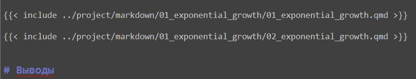{#fig-034 width=70%}

### Реализация модели с параметрами 

Для реализации модели с параметрами создаю файл scripts/02_exponential_growth.lj и переношу туда код из методички ([рис. @fig-035).

{#fig-035 width=70%}

Выполняем программу ([рис. @fig-036).

{#fig-036 width=70%}

Генерируем чистый код, jupyter notebook и документацию в формате Quarto с помощью tangle.jl ([рис. @fig-037]).

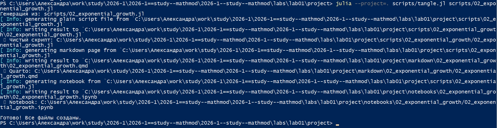{#fig-037 width=70%}

Открываем jupyter notebook и проверяем что все коды успешно запускаются ([рис. @fig-038]).

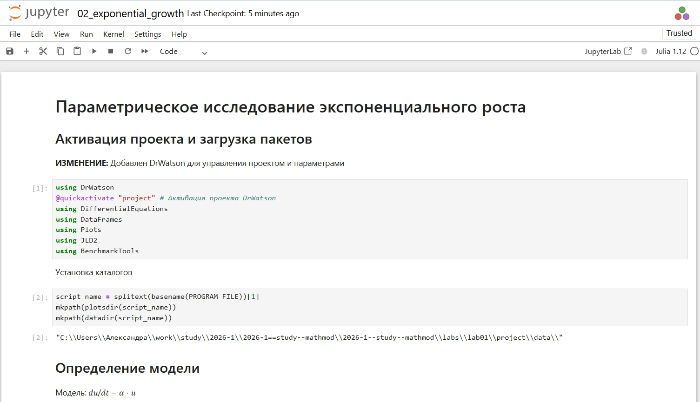{#fig-038 width=70%} 





# Выводы

В ходе выполнения лабораторной работы были решены следующие задачи:

1. Создано рабочее пространство для курса «Математическое моделирование» в соответствии с требованиями методических указаний.

2. Выполнена настройка системы контроля версий Git: заданы параметры пользователя, настроены `autocrlf` и `safecrlf`, созданы SSH- и PGP-ключи для безопасной работы с удалённым репозиторием и верификации коммитов.

3. Создан репозиторий на GitHub на основе шаблона, настроен Git Flow, создан и опубликован релиз версии 1.0.0.

4. Создан проект DrWatson в каталоге `labs/lab01/project`, установлены необходимые пакеты для работы.

5. Реализована модель экспоненциального роста на Julia. Проведён численный эксперимент: решено дифференциальное уравнение, построены графики, вычислено время удвоения.

6. Выполнено преобразование кода в литературный стиль с использованием `Literate.jl`. Сгенерированы производные форматы: чистый код, Jupyter Notebook и Quarto документ.

7. Проведено параметрическое исследование модели для набора значений коэффициента роста α. Построены сравнительные графики, проанализирована зависимость времени удвоения от α, выполнен бенчмаркинг.

Таким образом, в ходе работы был освоен полный цикл математического моделирования: от постановки задачи и формализации до численной реализации, параметрического исследования и оформления результатов с использованием современных инструментов для воспроизводимых научных вычислений.

# Список литературы{.unnumbered}

1. Королькова А. В., Кулябов Д. С. Математическое моделирование. Практикум : учебное пособие. — М. : РУДН, 2026. — 87 с.

2. Knuth D. E. Literate Programming // The Computer Journal. — 1984. — Vol. 27, no. 2. — P. 97–111. — DOI: 10.1093/comjnl/27.2.97 .

3. Chacon S., Straub B. Pro Git. — 2nd ed. — Apress, 2014. — 456 p. — URL: https://git-scm.com/book/ru/v2 (дата обращения: 13.08.2026) .

4. Driessen V. A successful Git branching model. — URL: https://nvie.com/posts/a-successful-git-branching-model/ (дата обращения: 13.08.2026) .

5. Conventional Commits. — URL: https://www.conventionalcommits.org/ (дата обращения: 13.08.2026) .

6. DrWatson.jl: Scientific project assistant software. — URL: https://juliadynamics.github.io/DrWatson.jl/stable/ (дата обращения: 13.08.2026) 
