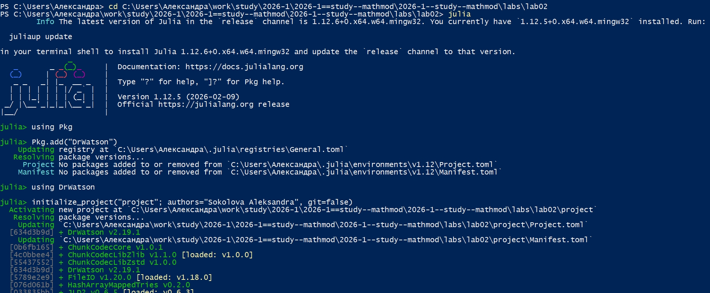
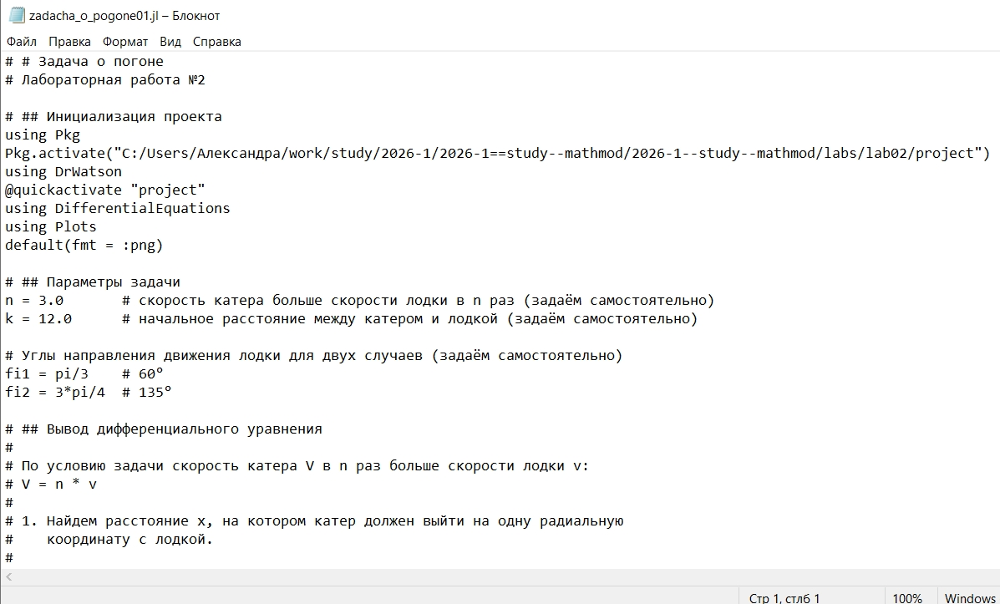
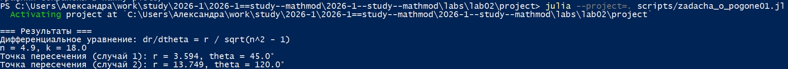
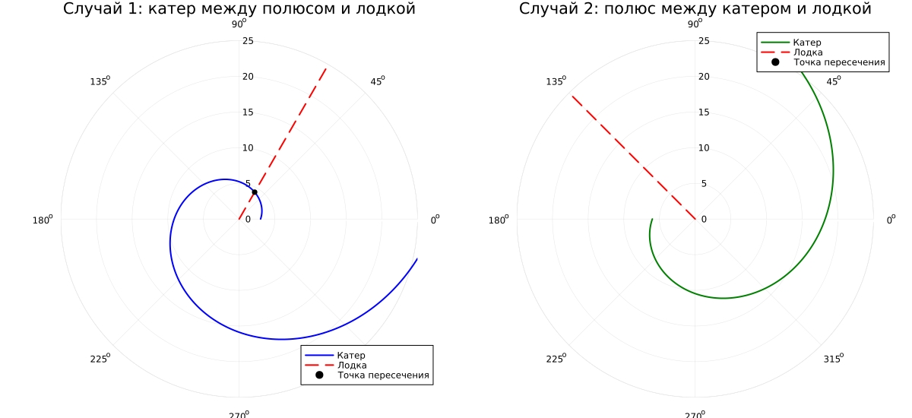
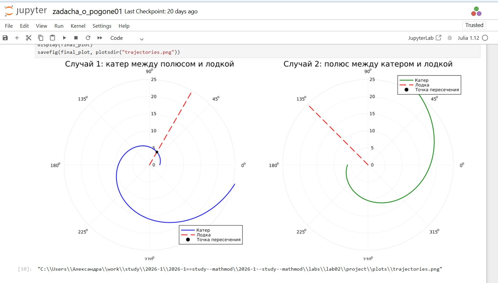
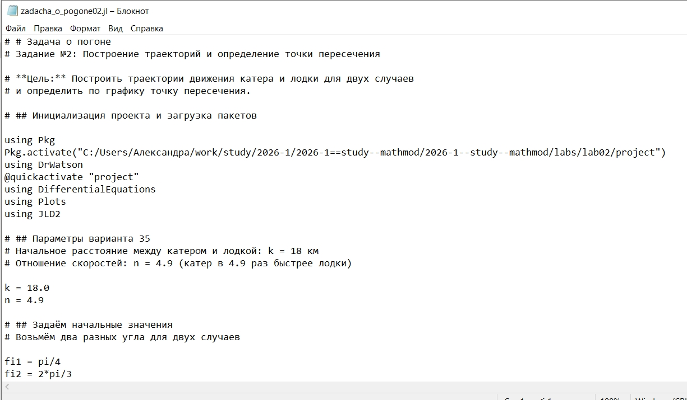
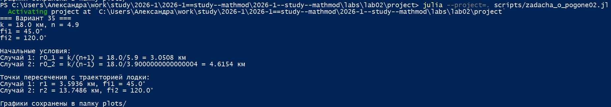
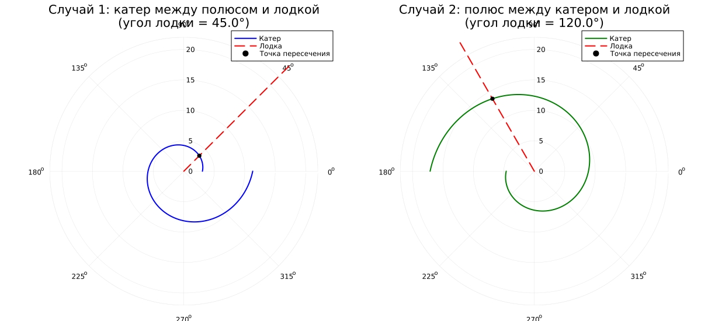
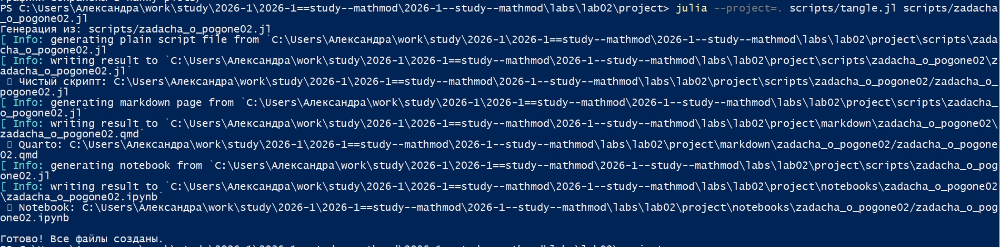
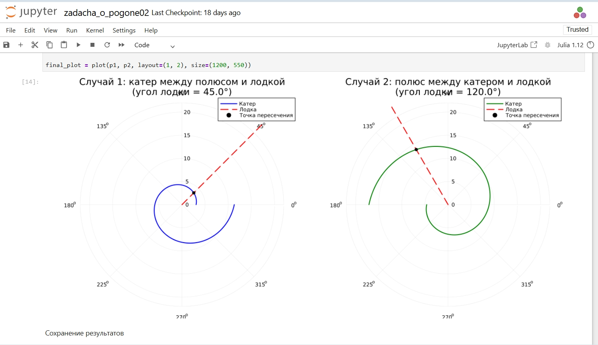

---
## Author
author:
  name: Соколова Александра Олеговна
  degrees: DSc
  orcid: 0000-0002-0877-7063
  email: 1132236034s@rudn.ru
  affiliation:
    - name: Российский университет дружбы народов
      country: Российская Федерация
      postal-code: 117198
      city: Москва
      address: ул. Миклухо-Маклая, д. 6
## Title
title: Презентация по лабораторной работе №2
subtitle: Математическое моделирование
license: CC BY
date: today
date-format: "YYYY-MM-DD" # Example: 2025-09-06
---

## Цель работы

Построить траектории движения катера береговой охраны и лодки браконьеров для задачи преследования в полярных координатах, определить точки пересечения траекторий для двух случаев расположения объектов, освоить методы численного решения дифференциальных уравнений в Julia и визуализации результатов моделирования.

## Выполнение лабораторной работы

Начинаю выполнение лабораторной с инициализации проекта DrWatson ([рис. @fig-001]).

{#fig-001 width=70%}

## Задача о погоне

Для реализации задачи о погоне создаю файл scripts/zadacha_o_pogone01.jl и записываю туда скрипт ([рис. @fig-002]).

{#fig-002 width=70%}

## Задача о погоне

Запускаю скрипт командой "julia --project=. scripts/zadacha_o_pogone01.jl. В консоль выводится дифференциальное уравнение и точки пересечения для двух случаев, результирующий график сохраняется в папку "plots" ([рис. @fig-003]).

{#fig-003 width=70%}

## Задача о погоне

Просматриваю результирующий график в папке "plots" ([рис. @fig-004]).

{#fig-004 width=70%}

## Задача о погоне

Создаю файл tangle.jl для дальнейшей генерации производных форматов ([рис. @fig-005]).

{#fig-005 width=70%}

## Задача о погоне

Генерирую чистый код, jupyter notebook и документацию в формате Quarto с помощью tangle.jl ([рис. @fig-006]).

{#fig-006 width=70%}

## Задача о погоне

Открываю jupyter notebook и проверяю, что все коды успешно запускаются ([рис. @fig-007]).

{#fig-007 width=70%}

## Задача о погоне. Вариант 35

Для реализации задания из личного варианта 35 создаю файл scripts/zadacha_o_pogone02.jl и записываю туда скрипт ([рис. @fig-008]).

{#fig-008 width=70%}

## Задача о погоне. Вариант 35

Запускаю скрипт командой "julia --project=. scripts/zadacha_o_pogone02.jl. В консоль выводятся параметры модели, начальные условия и точки пересечения для двух случаев. Результирующий график сохраняется в папку "plots" ([рис. @fig-009]).

{#fig-009 width=70%}

## Задача о погоне. Вариант 35

Просматриваю результирующий график в папке "plots" ([рис. @fig-010]).

{#fig-010 width=70%}

## Задача о погоне. Вариант 35

Генерирую чистый код, jupyter notebook и документацию в формате Quarto с помощью tangle.jl ([рис. @fig-011]).

{#fig-011 width=70%}

## Задача о погоне. Вариант 35

Открываю jupyter notebook и проверяю, что все коды успешно запускаются ([рис. @fig-012]).

{#fig-012 width=70%}

## Выводы

В ходе выполнения лабораторной работы были решены задачи преследования браконьерской лодки катером береговой охраны для общего задания и индивидуального варианта 35.

Установлено, что при увеличении отношения скоростей $n$ траектория катера становится более пологой, а точки пересечения смещаются к меньшим значениям радиальной координаты. Модель демонстрирует, что при правильной стратегии движения (выход на одну радиальную координату с лодкой, затем движение по логарифмической спирали) катер гарантированно настигает лодку. Полученные результаты подтверждают эффективность предложенного метода решения задачи преследования.

