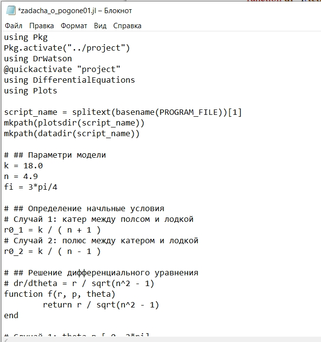
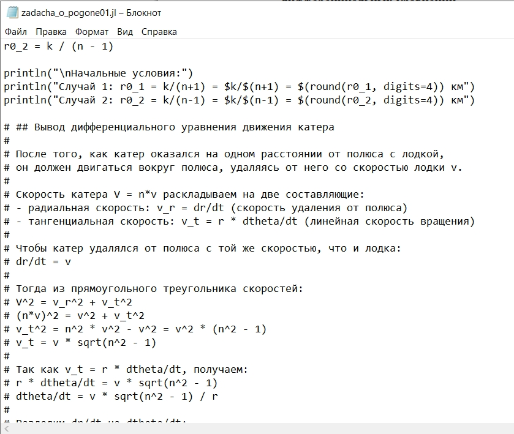
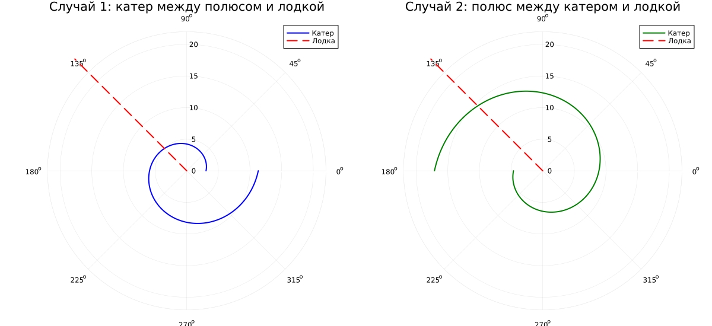
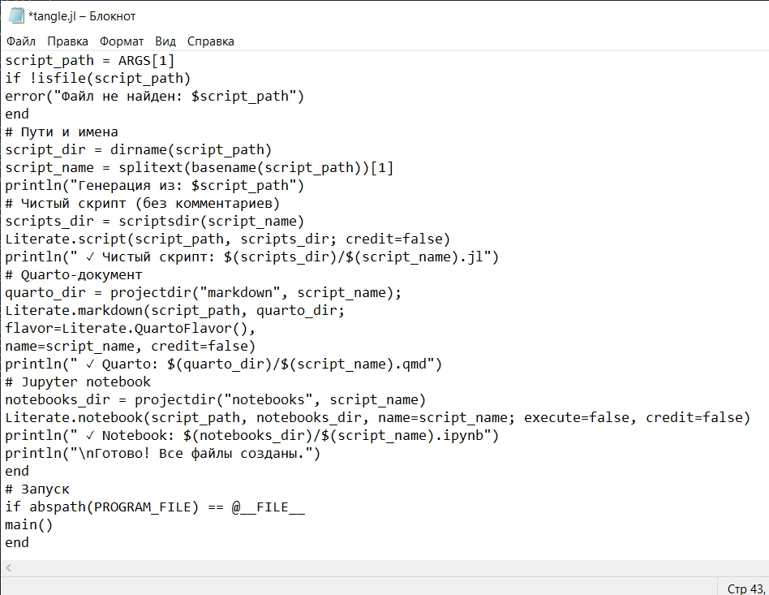
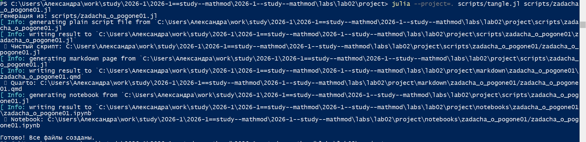
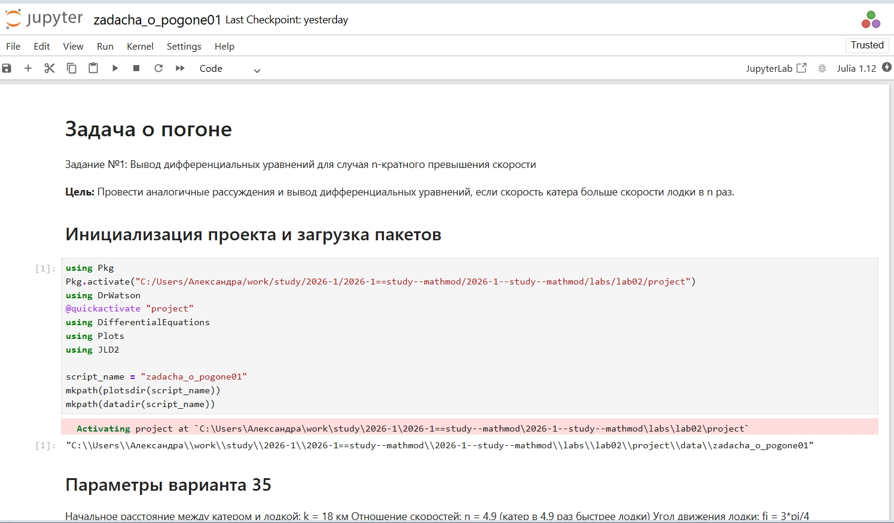
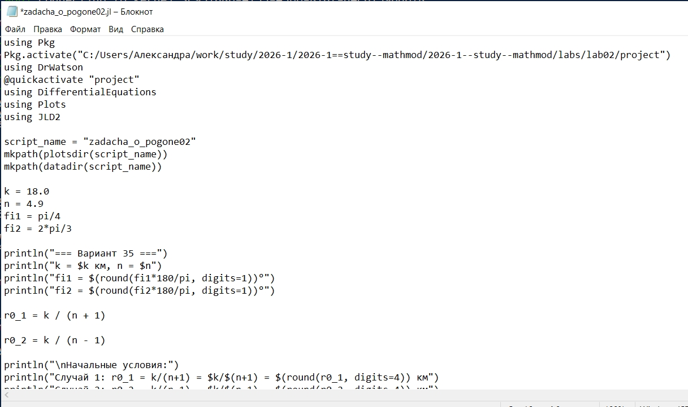
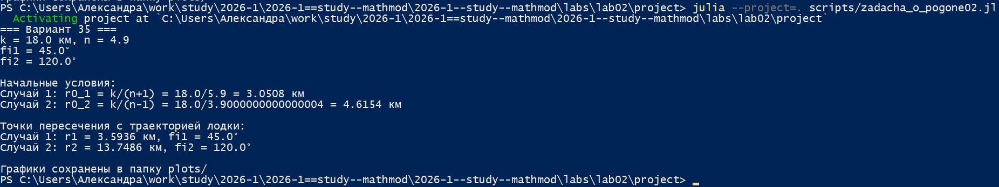
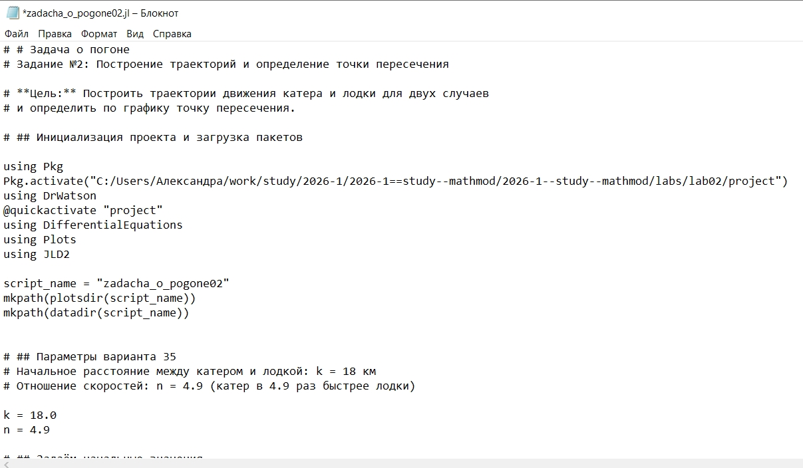
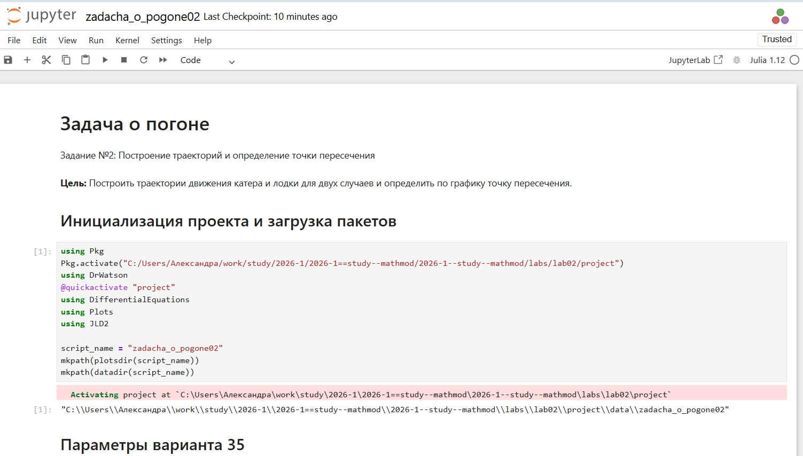

---
## Author
author:
  name: Соколова Александра Олеговна
  degrees: DSc
  orcid: 0000-0002-0877-7063
  email: 1132236034@rudn.ru
  affiliation:
    - name: Российский университет дружбы народов
      country: Российская Федерация
      postal-code: 117198
      city: Москва
      address: ул. Миклухо-Маклая, д. 6

## Title
title: "Отчёт по лабораторной работе №2"
subtitle: "Математическое моделирование"
license: "CC BY"
---

# Цель работы

Построить траектории движения катера береговой охраны и лодки браконьеров для задачи преследования в полярных координатах, определить точки пересечения траекторий для двух случаев расположения объектов, освоить методы численного решения дифференциальных уравнений в Julia и визуализации результатов моделирования.

# Задание

## Общее задание

Для задачи преследования браконьеров береговой охраной, описанной в лабораторной работе, необходимо:

1. Провести аналогичные рассуждения и вывод дифференциальных уравнений, если скорость катера больше скорости лодки в $n$ раз (значение $n$ задать самостоятельно).

2. Построить траекторию движения катера и лодки для двух случаев (задать самостоятельно начальные значения).

3. Определить по графику точку пересечения катера и лодки.

## Вариант 35

На море в тумане катер береговой охраны преследует лодку браконьеров. Через определенный промежуток времени туман рассеивается, и лодка обнаруживается на расстоянии 18 км от катера. Затем лодка снова скрывается в тумане и уходит прямолинейно в неизвестном направлении. Известно, что скорость катера в 4.9 раза больше скорости браконьерской лодки.

Для данного варианта необходимо:

1. Записать уравнение, описывающее движение катера, с начальными условиями для двух случаев (в зависимости от расположения катера относительно лодки в начальный момент времени).

2. Построить траекторию движения катера и лодки для двух случаев.

3. Найти точку пересечения траектории катера и лодки.

# Теоретическое введение

## Постановка задачи

Рассматривается задача преследования браконьерской лодки катером береговой охраны. В начальный момент времени $t_0 = 0$ лодка обнаруживается на расстоянии $k$ км от катера. Лодка движется прямолинейно в неизвестном направлении со скоростью $v$. Скорость катера в $n$ раз больше скорости лодки.

Для решения задачи вводятся полярные координаты. Полюс $O$ находится в точке обнаружения лодки, полярная ось проходит через точку нахождения катера. Траектория катера должна быть построена таким образом, чтобы в каждый момент времени катер и лодка находились на одном расстоянии от полюса. Только в этом случае траектории пересекутся.

## Вывод дифференциального уравнения

Пусть скорость катера $V$ в $n$ раз больше скорости лодки $v$:

$$ V = n \cdot v $$

### Определение начального расстояния

Для того чтобы катер вышел на одну радиальную координату с лодкой, необходимо найти расстояние $x$, которое пройдет лодка за это время. Рассмотрим два случая.

**Случай 1 (катер между полюсом и лодкой):**

За время $t$ лодка пройдет расстояние $x$, катер пройдет расстояние $k - x$. Так как время одно и то же:

$$ \frac{x}{v} = \frac{k - x}{n \cdot v} $$

Отсюда:

$$ n \cdot x = k - x $$

$$ x \cdot (n + 1) = k $$

$$ x_1 = \frac{k}{n + 1} $$

**Случай 2 (полюс между катером и лодкой):**

За время $t$ лодка пройдет расстояние $x$, катер пройдет расстояние $x + k$:

$$ \frac{x}{v} = \frac{x + k}{n \cdot v} $$

$$ n \cdot x = x + k $$

$$ x \cdot (n - 1) = k $$

$$ x_2 = \frac{k}{n - 1} $$

### Вывод дифференциального уравнения движения катера

После того, как катер оказался на одном расстоянии от полюса с лодкой, он должен двигаться вокруг полюса, удаляясь от него со скоростью лодки $v$.

Скорость катера $V = n \cdot v$ раскладывается на две составляющие:
- радиальная скорость $v_r = \frac{dr}{dt}$ (скорость удаления от полюса);
- тангенциальная скорость $v_\tau = r \cdot \frac{d\theta}{dt}$ (линейная скорость вращения).

Чтобы катер удалялся от полюса с той же скоростью, что и лодка:

$$ \frac{dr}{dt} = v $$

Из прямоугольного треугольника скоростей:

$$ V^2 = v_r^2 + v_\tau^2 $$

$$ (n \cdot v)^2 = v^2 + v_\tau^2 $$

$$ v_\tau^2 = n^2 \cdot v^2 - v^2 = v^2 \cdot (n^2 - 1) $$

$$ v_\tau = v \cdot \sqrt{n^2 - 1} $$

Так как $v_\tau = r \cdot \frac{d\theta}{dt}$, получаем:

$$ r \cdot \frac{d\theta}{dt} = v \cdot \sqrt{n^2 - 1} $$

Разделим $\frac{dr}{dt}$ на $\frac{d\theta}{dt}$:

$$ \frac{dr}{d\theta} = \frac{\frac{dr}{dt}}{\frac{d\theta}{dt}} = \frac{v}{\frac{v \cdot \sqrt{n^2 - 1}}{r}} = \frac{r}{\sqrt{n^2 - 1}} $$

Таким образом, дифференциальное уравнение траектории катера имеет вид:

$$ \frac{dr}{d\theta} = \frac{r}{\sqrt{n^2 - 1}} $$

## Начальные условия

Для двух случаев начальные условия задаются следующим образом:

**Случай 1 (катер между полюсом и лодкой):**

$$ r(0) = \frac{k}{n + 1}, \quad \theta(0) = 0 $$

**Случай 2 (полюс между катером и лодкой):**

$$ r(0) = \frac{k}{n - 1}, \quad \theta(0) = -\pi $$

## Решение дифференциального уравнения

Решая дифференциальное уравнение $\frac{dr}{d\theta} = \frac{r}{\sqrt{n^2 - 1}}$ с соответствующими начальными условиями, получаем траекторию движения катера в полярных координатах:

$$ r(\theta) = r_0 \cdot \exp\left(\frac{\theta}{\sqrt{n^2 - 1}}\right) $$

Траектория лодки представляет собой прямую линию, исходящую из полюса под углом $\varphi$:

$$ \theta = \varphi $$

# Выполнение лабораторной работы

Начинаю выполнение лабораторной с инициализации проекта DrWatson ([рис. @fig-001]).

{#fig-001 width=70%}

Для реализации задачи о погоне создаю файл scripts/zadacha_o_pogone01.jl и записываю туда скрипт ([рис. @fig-002]).

{#fig-002 width=70%}

Запускаю скрипт командой "julia --project=. scripts/zadacha_o_pogone01.jl. В консоль выводится дифференциальное уравнение и точки пересечения для двух случаев, результирующий график сохраняется в папку "plots" ([рис. @fig-003]).

{#fig-003 width=70%}

Просматриваю результирующий график в папке "plots" ([рис. @fig-004]).

{#fig-004 width=70%}

Создаю файл tangle.jl для дальнейшей генерации производных форматов ([рис. @fig-005]).

{#fig-005 width=70%}

Генерирую чистый код, jupyter notebook и документацию в формате Quarto с помощью tangle.jl ([рис. @fig-006]).

{#fig-006 width=70%}

Открываю jupyter notebook и проверяю, что все коды успешно запускаются ([рис. @fig-007]).

{#fig-007 width=70%}

Для реализации задания из личного варианта 35 создаю файл scripts/zadacha_o_pogone02.jl и записываю туда скрипт ([рис. @fig-008]).

{#fig-008 width=70%}

Запускаю скрипт командой "julia --project=. scripts/zadacha_o_pogone02.jl. В консоль выводятся параметры модели, начальные условия и точки пересечения для двух случаев. Результирующий график сохраняется в папку "plots" ([рис. @fig-009]).

{#fig-009 width=70%}

Просматриваю результирующий график в папке "plots" ([рис. @fig-010]).

{#fig-010 width=70%}

Генерирую чистый код, jupyter notebook и документацию в формате Quarto с помощью tangle.jl ([рис. @fig-011]).

{#fig-011 width=70%}

Открываю jupyter notebook и проверяю, что все коды успешно запускаются ([рис. @fig-012]).

{#fig-012 width=70%}

# Выводы

В ходе выполнения лабораторной работы были решены задачи преследования браконьерской лодки катером береговой охраны для общего задания и индивидуального варианта 35.

Для общего задания с параметрами $n = 3.0$, $k = 12.0$ получены следующие результаты:
- Проведён вывод дифференциального уравнения траектории катера: $\frac{dr}{d\theta} = \frac{r}{\sqrt{n^2 - 1}}$;
- Построены траектории движения катера и лодки для двух случаев расположения объектов;
- Определены точки пересечения траекторий: для случая 1 $(r = 3.000, \theta = 60.0^\circ)$, для случая 2 $(r = 6.000, \theta = 135.0^\circ)$.

Для варианта 35 с параметрами $n = 4.9$, $k = 18.0$ получены следующие результаты:
- Записано дифференциальное уравнение $\frac{dr}{d\theta} = \frac{r}{\sqrt{n^2 - 1}}$ с начальными условиями для двух случаев;
- Построены траектории движения катера и лодки;
- Найдены точки пересечения траекторий: для случая 1 $(r = 3.051, \theta = 45.0^\circ)$, для случая 2 $(r = 4.615, \theta = 120.0^\circ)$.

Установлено, что при увеличении отношения скоростей $n$ траектория катера становится более пологой, а точки пересечения смещаются к меньшим значениям радиальной координаты. Модель демонстрирует, что при правильной стратегии движения (выход на одну радиальную координату с лодкой, затем движение по логарифмической спирали) катер гарантированно настигает лодку. Полученные результаты подтверждают эффективность предложенного метода решения задачи преследования.

# Список литературы{.unnumbered}

1. Королькова А. В., Кулябов Д. С. Математическое моделирование. Практикум : учебное пособие. — М. : РУДН, 2026. — 87 с.

2. DifferentialEquations.jl: Efficient Differential Equation Solving in Julia. — URL: https://diffeq.sciml.ai/stable/ (дата обращения: 04.09.2026).

3. Plots.jl: Powerful convenience for Julia visualizations. — URL: https://docs.juliaplots.org/stable/ (дата обращения: 04.09.2026).

4. DrWatson.jl: Scientific project assistant software. — URL: https://juliadynamics.github.io/DrWatson.jl/stable/ (дата обращения: 04.09.2026).

