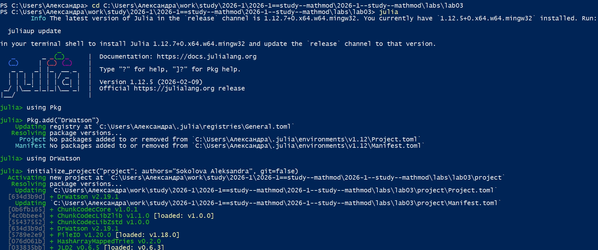
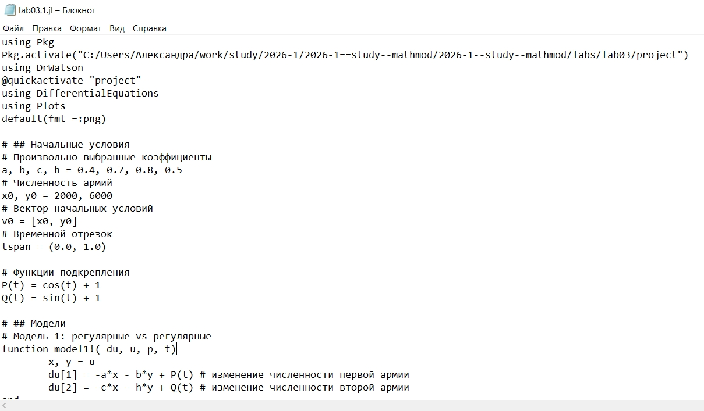
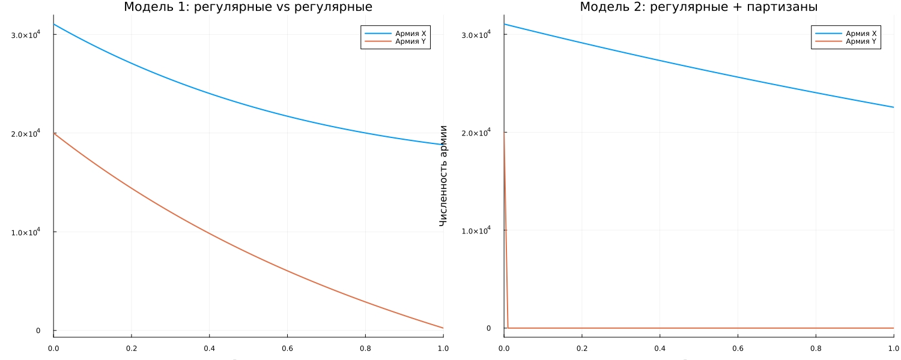
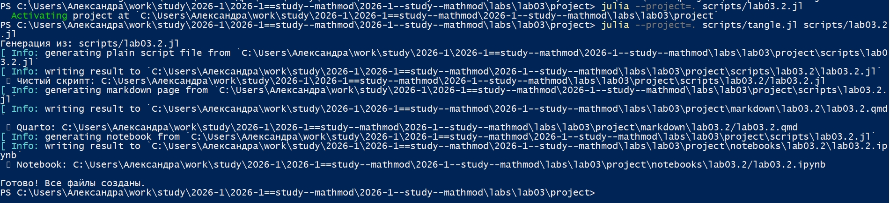
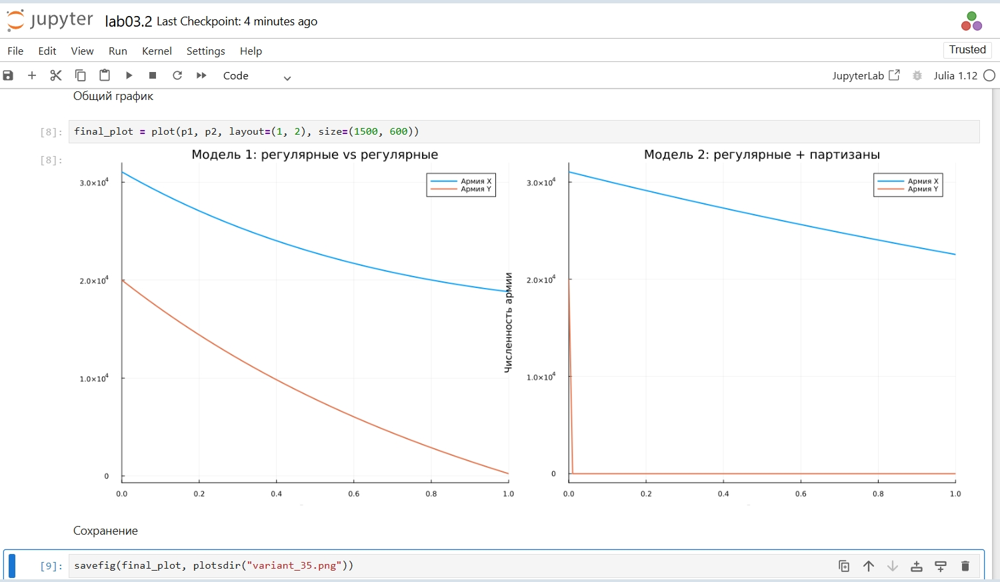

---
## Author
author:
  name: Соколова Александра Олеговна
  degrees: DSc
  orcid: 0000-0002-0877-7063
  email: 1132236034s@rudn.ru
  affiliation:
    - name: Российский университет дружбы народов
      country: Российская Федерация
      postal-code: 117198
      city: Москва
      address: ул. Миклухо-Маклая, д. 6
## Title
title: Презентация по лабораторной работе №3
subtitle: Математическое моделирование
license: CC BY
date: today
date-format: "YYYY-MM-DD" # Example: 2025-09-06
---

## Цель работы

Изучить простейшие математические модели боевых действий (модели Ланчестера) и исследовать изменение численности войск противоборствующих сторон в различных сценариях ведения войны.

## Подготовка рабочего пространства

Начинаю выполнение лабораторной с инициализации проекта DrWatson ([рис. @fig-001]).

{#fig-001 width=70%}

## Модель боевых действий

Для выполнения 1 части задания создаю файл scripts/lab03.1.jl и записываю туда скрипт, который позволит: проверить как работает модель в различных ситуациях, построить графики y(t) и x(t) в рассматриваемых случаях. Определить победителя, найти условие, при котором та или другая сторона выигрывают бой (для каждого случая) ([рис. @fig-002]).

{#fig-002 width=70%}

## Модель боевых действий

Создаю файл tangle.jl для дальнейшей генерации производных форматов ([рис. @fig-003]).

{#fig-003 width=70%}

## Модель боевых действий

Генерирую чистый код, jupyter notebook и документацию в формате Quarto с помощью tangle.jl ([рис. @fig-004]).

{#fig-004 width=70%}

## Модель боевых действий

Открываю jupyter notebook и проверяю, что все коды успешно запускаются ([рис. @fig-005]).

{#fig-005 width=70%}

## Модель боевых действий

Для выполнения 2 части задания создаю файл scripts/lab03.2.jl и записываю туда скрипт, который позволит построить графики изменения численности войск армии Х и армии У для заданных в варианте случаев ([рис. @fig-006]).

{#fig-006 width=70%}

## Модель боевых действий

Просматриваю результирующие графики в папке "plots" ([рис. @fig-007]).

{#fig-007 width=70%}

## Модель боевых действий

Генерирую чистый код, jupyter notebook и документацию в формате Quarto с помощью tangle.jl ([рис. @fig-008]).

{#fig-008 width=70%}

## Модель боевых действий

Открываю jupyter notebook и проверяю, что все коды успешно запускаются ([рис. @fig-009]).

{#fig-009 width=70%}

## Выводы

В ходе выполнения лабораторной работы были рассмотрены некоторые простейшие модели боевых действий – модели Ланчестера. Были изучены и визуализированы три случая ведения боевых действий: 
1. Боевые действия между регулярными войсками
2. Боевые действия с участием регулярных войск и партизанских
отрядов
3. Боевые действия между партизанскими отрядами 
