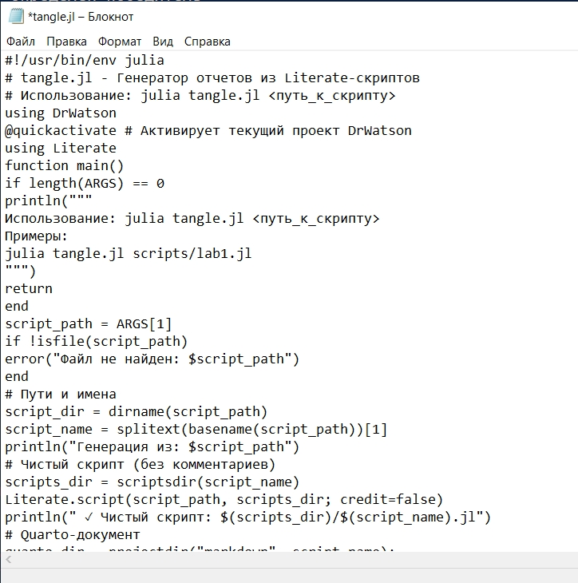
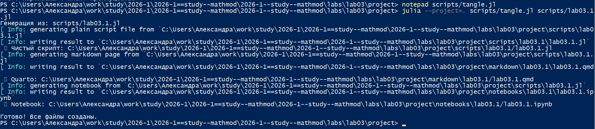
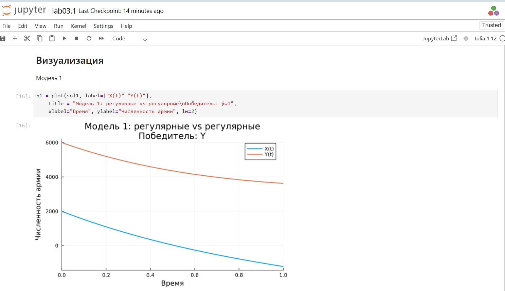
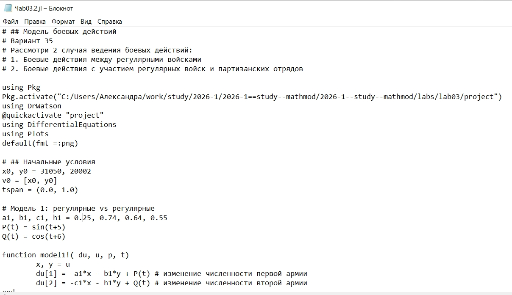

---
## Author
author:
  name: Соколова Александра Олеговна
  degrees: DSc
  orcid: 0000-0002-0877-7063
  email: 1132236034@rudn.ru
  affiliation:
    - name: Российский университет дружбы народов
      country: Российская Федерация
      postal-code: 117198
      city: Москва
      address: ул. Миклухо-Маклая, д. 6

## Title
title: "Отчёт по лабораторной работе №3"
subtitle: "Математическое моделирование"
license: "CC BY"
---

# Цель работы

Изучить простейшие математические модели боевых действий (модели Ланчестера) и исследовать изменение численности войск противоборствующих сторон в различных сценариях ведения войны.

# Задание

1. Проверить как работает модель в различных ситуациях, построить графики y(t) и x(t) в рассматриваемых случаях. Определить победителя, найти условие, при котором та или другая сторона выигрывают бой (для каждого случая).
2. Из варианта 35: построить графики изменения численности войск армии Х и армии У для заданных в варианте случаев.

# Теоретическое введение

Модели Ланчестера описывают динамику численности войск двух противоборствующих сторон. В общем случае рассматриваются три сценария ведения боевых действий:

1. Боевые действия между регулярными войсками
2. Боевые действия с участием регулярных войск и партизанских отрядов
3. Боевые действия между партизанскими отрядами

Численность регулярных войск определяется тремя факторами:
- потерями, не связанными с боевыми действиями (болезни, дезертирство);
- потерями от действий противника;
- поступлением подкреплений.

## Модель 1: Регулярные войска против регулярных войск

В этом случае модель описывается системой дифференциальных уравнений:

$$\begin{cases}
\dfrac{dx}{dt} = -a x(t) - b y(t) + P(t) \\[10pt]
\dfrac{dy}{dt} = -c x(t) - h y(t) + Q(t)
\end{cases}$$

где:
- $x(t)$, $y(t)$ — численности армий X и Y;
- $a$, $h$ — коэффициенты потерь, не связанных с боевыми действиями;
- $b$, $c$ — коэффициенты эффективности боевых действий;
- $P(t)$, $Q(t)$ — функции подкрепления.

## Модель 2: Регулярные войска против партизан

Партизанские отряды менее уязвимы, так как действуют скрытно. Противнику приходится действовать неизбирательно, по площадям. Поэтому потери партизан пропорциональны произведению численностей $x \cdot y$:

$$\begin{cases}
\dfrac{dx}{dt} = -a x(t) - b y(t) + P(t) \\[10pt]
\dfrac{dy}{dt} = -c x(t) y(t) - h y(t) + Q(t)
\end{cases}$$

## Модель 3: Партизаны против партизан

Обе стороны действуют скрытно, поэтому потери пропорциональны произведению численностей:

$$\begin{cases}
\dfrac{dx}{dt} = -a x(t) - b x(t) y(t) + P(t) \\[10pt]
\dfrac{dy}{dt} = -h y(t) - c x(t) y(t) + Q(t)
\end{cases}$$

## Условия победы

В простейшем случае (без подкреплений и потерь, не связанных с боем) системы допускают аналитическое решение.

Для модели 1 сохраняется величина:

$$c x^2 - b y^2 = \text{const}$$

Если $c x_0^2 > b y_0^2$, побеждает армия X; если $c x_0^2 < b y_0^2$ — армия Y.

Для модели 2 сохраняется величина:

$$\frac{b}{2} x^2 - c y = \text{const}$$

При $C_1 > 0$ побеждает регулярная армия, при $C_1 < 0$ — партизаны.

# Выполнение лабораторной работы

Начинаю выполнение лабораторной с инициализации проекта DrWatson ([рис. @fig-001]).

{#fig-001 width=70%}

Для выполнения 1 части задания создаю файл scripts/lab03.1.jl и записываю туда скрипт, который позволит: проверить как работает модель в различных ситуациях, построить графики y(t) и x(t) в рассматриваемых случаях. Определить победителя, найти условие, при котором та или другая сторона выигрывают бой (для каждого случая) ([рис. @fig-002]).

{#fig-002 width=70%}

Создаю файл tangle.jl для дальнейшей генерации производных форматов ([рис. @fig-003]).

{#fig-003 width=70%}

Генерирую чистый код, jupyter notebook и документацию в формате Quarto с помощью tangle.jl ([рис. @fig-004]).

{#fig-004 width=70%}

Открываю jupyter notebook и проверяю, что все коды успешно запускаются ([рис. @fig-005]).

{#fig-005 width=70%}

Для выполнения 2 части задания создаю файл scripts/lab03.2.jl и записываю туда скрипт, который позволит построить графики изменения численности войск армии Х и армии У для заданных в варианте случаев ([рис. @fig-006]).

{#fig-006 width=70%}

Просматриваю результирующие графики в папке "plots" ([рис. @fig-007]).

{#fig-007 width=70%}

Генерирую чистый код, jupyter notebook и документацию в формате Quarto с помощью tangle.jl ([рис. @fig-008]).

{#fig-008 width=70%}

Открываю jupyter notebook и проверяю, что все коды успешно запускаются ([рис. @fig-009]).

{#fig-009 width=70%}

#| echo: false
#| warning: false
#| message: false
using Pkg
Pkg.activate("C:/Users/Александра/work/study/2026-1/2026-1==study--mathmod/2026-1--study--mathmod/labs/lab03/project")
using DrWatson
@quickactivate "project"
using DifferentialEquations
using Plots
default(fmt = :png)





# Выводы

В ходе выполнения лабораторной работы были исследованы три модели боевых действий Ланчестера.

1. **Модель регулярных войск** показала, что победа зависит от начальной численности и эффективности вооружения сторон. Преимущество в численности компенсируется квадратичным ростом требуемой эффективности.

2. **Модель с участием партизан** продемонстрировала, что партизанские отряды находятся в менее выгодном положении: для победы им требуется увеличивать численность пропорционально квадрату численности регулярных войск.

3. **Модель партизанских отрядов** показала, что при скрытных действиях обеих сторон динамика потерь замедляется, и бой может длиться значительно дольше.

4. Подкрепления $P(t)$ и $Q(t)$ могут существенно изменить исход боя по сравнению с упрощенными моделями без подкреплений.

# Список литературы{.unnumbered}

1. Королькова А. В., Кулябов Д. С. Математическое моделирование. Практикум : учебное пособие. — М. : РУДН, 2026. — 87 с.

2. Ланчестер Ф. У. Aircraft in Warfare: The Dawn of the Fourth Arm. — London: Constable and Company, 1916.

3. Самарский А. А., Михайлов А. П. Математическое моделирование: Идеи. Методы. Примеры. — М.: Физматлит, 2005.

4. Петров А. П., Мальцев А. С. Математическое моделирование в военном деле. — М.: ВА РВСН, 2010.
