---
## Author
author:
  name: Соколова Александра Олеговна
  degrees: DSc
  orcid: 0000-0002-0877-7063
  email: 1132236034@rudn.ru
  affiliation:
    - name: Российский университет дружбы народов
      country: Российская Федерация
      postal-code: 117198
      city: Москва
      address: ул. Миклухо-Маклая, д. 6

## Title
title: "Отчёт по лабораторной работе №4"
subtitle: "Математическое моделирование"
license: "CC BY"
---

# Цель работы

Построить решения и фазовые портреты гармонического осциллятора для трёх случаев: без затухания, с затуханием и при действии внешней силы. Освоить методы численного решения дифференциальных уравнений в Julia и визуализации фазовых траекторий.

# Задание

1.1 Построить решение уравнения гармонического осциллятора без затухания 

1.2 Записать уравнение свободных колебаний гармонического осциллятора с
затуханием, построить его решение. Построить фазовый портрет гармонических
колебаний с затуханием.

1.3 Записать уравнение колебаний гармонического осциллятора, если на систему
действует внешняя сила, построить его решение. Построить фазовый портрет
колебаний с действием внешней силы.

Вариант 35:

Постройте фазовый портрет гармонического осциллятора и решение уравнения
гармонического осциллятора для следующих случаев:

2.1 $$ \ddot{x} + 7.4x = 0 $$

2.2 $$ \ddot{x} + 10.1\dot{x} + 0.1x = 0 $$

2.3 $$ \ddot{x} + 3\dot{x} + 3.3x = 0.2\sin(3.5t) $$

# Теоретическое введение

## Гармонический осциллятор

Гармонический осциллятор — одна из фундаментальных моделей в физике и математике, описывающая поведение систем, совершающих колебательные движения около положения равновесия. К таким системам относятся: грузик на пружине, математический маятник (при малых углах), электрический колебательный контур и многие другие. Несмотря на различную физическую природу, эти системы описываются одним и тем же дифференциальным уравнением второго порядка.

Уравнение свободных колебаний гармонического осциллятора имеет вид:

$$\ddot{x} + 2\gamma \dot{x} + \omega_0^2 x = 0$$

где:
- $x$ — переменная, описывающая состояние системы (смещение, заряд и т.д.);
- $\gamma$ — коэффициент затухания, характеризующий потери энергии;
- $\omega_0$ — собственная частота колебаний;
- $t$ — время.

При отсутствии потерь ($\gamma = 0$) уравнение принимает вид консервативного осциллятора:

$$\ddot{x} + \omega_0^2 x = 0$$

энергия которого сохраняется во времени.

## Фазовое пространство и фазовый портрет

Дифференциальное уравнение второго порядка можно представить в виде системы двух уравнений первого порядка, введя новую переменную $v = \dot{x}$:

$$\begin{cases}
\dot{x} = v \\
\dot{v} = -\omega_0^2 x - 2\gamma v
\end{cases}$$

Независимые переменные $x$ и $v$ определяют **фазовое пространство** системы. Поскольку оно двумерно, его называют **фазовой плоскостью**. Значение фазовых координат в любой момент времени полностью определяет состояние системы.

Решению уравнения движения как функции времени отвечает гладкая кривая на фазовой плоскости, которая называется **фазовой траекторией**. Совокупность фазовых траекторий, соответствующих различным начальным условиям, образует **фазовый портрет** системы.

Фазовый портрет позволяет качественно анализировать поведение системы:
- Для консервативного осциллятора фазовые траектории представляют собой замкнутые эллипсы (или окружности), что соответствует периодическим колебаниям с постоянной амплитудой.
- При наличии затухания траектории представляют собой спирали, сходящиеся к началу координат — точке устойчивого равновесия.
- При действии внешней силы возможны более сложные траектории, включая предельные циклы.

## Модель вынужденных колебаний

При действии на систему внешней периодической силы уравнение принимает вид:

$$\ddot{x} + 2\gamma \dot{x} + \omega_0^2 x = F(t)$$

Если внешняя сила гармоническая: $F(t) = F_0 \sin(\Omega t)$, то уравнение запишется как:

$$\ddot{x} + 2\gamma \dot{x} + \omega_0^2 x = F_0 \sin(\Omega t)$$

где:
- $F_0$ — амплитуда внешней силы;
- $\Omega$ — частота внешней силы.

В этом случае система уравнений первого порядка имеет вид:

$$\begin{cases}
\dot{x} = v \\
\dot{v} = -\omega_0^2 x - 2\gamma v + F_0 \sin(\Omega t)
\end{cases}$$

# Выполнение лабораторной работы

Начинаю выполнение лабораторной с инициализации проекта DrWatson ([рис. @fig-001]).

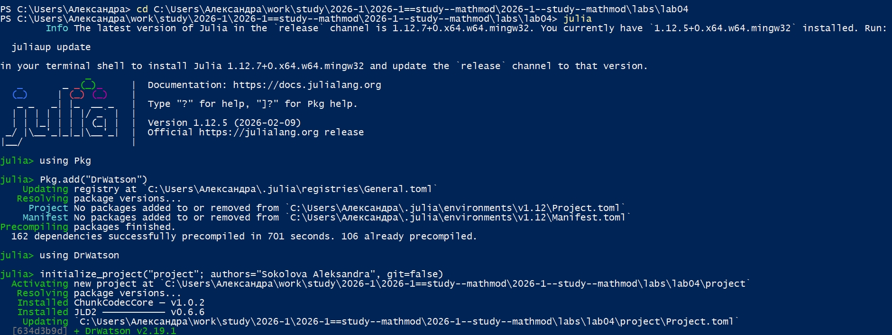{#fig-001 width=70%}

Для реализации построения решения уравнения гармонического осциллятора без затухания создаю файл scripts/lab04.1.jl и записываю туда скрипт ([рис. @fig-002]).

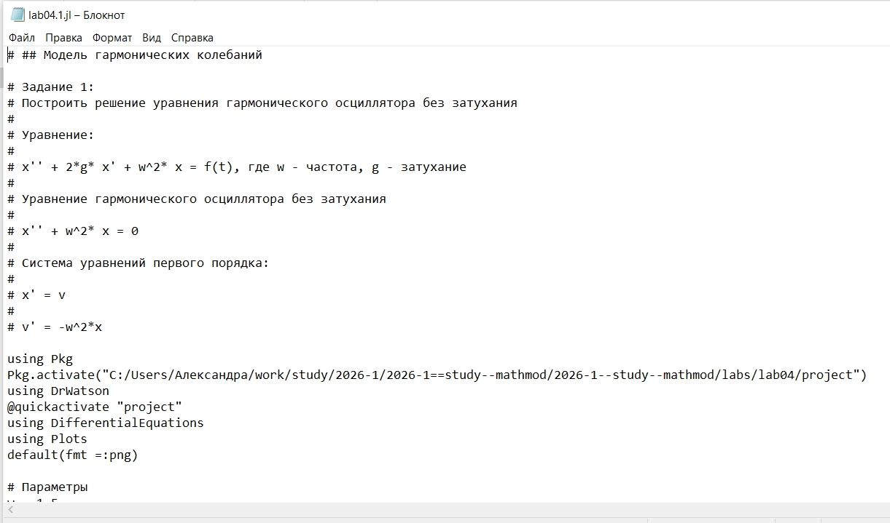{#fig-002 width=70%}

Запускаю скрипт командой "julia --project=. scripts/lab04.1.jl ([рис. @fig-003]).

{#fig-003 width=70%}

Просматриваю результирующий график в папке "plots" ([рис. @fig-004]).

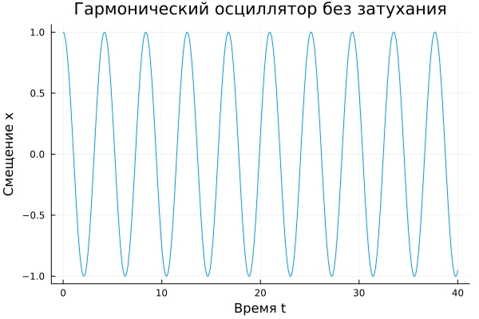{#fig-004 width=70%}

Создаю файл tangle.jl для дальнейшей генерации производных форматов ([рис. @fig-005]).

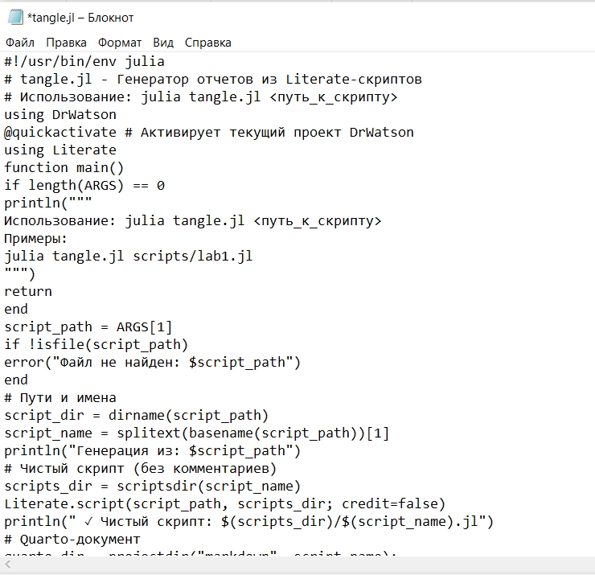{#fig-005 width=70%}

Генерирую чистый код, jupyter notebook и документацию в формате Quarto с помощью tangle.jl ([рис. @fig-006]).

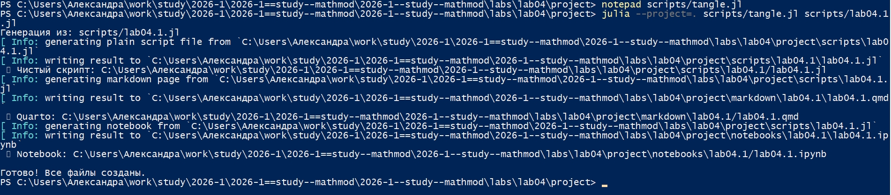{#fig-006 width=70%}

Открываю jupyter notebook и проверяю, что все коды успешно запускаются ([рис. @fig-007]).

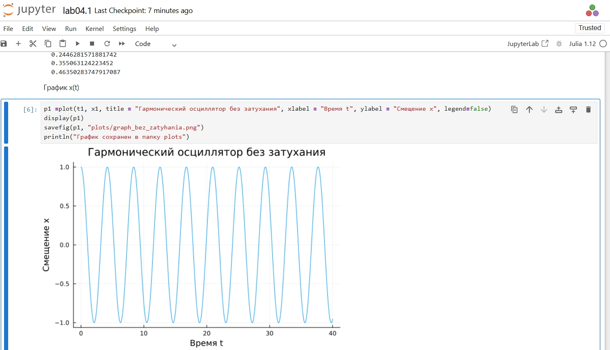{#fig-007 width=70%}

Для реализации построения решения уравнения гармонического осциллятора с затуханием, а также построения фазового портрета гармонических колебаний с затуханием создаю файл scripts/lab04.2.jl и записываю туда скрипт ([рис. @fig-008]).

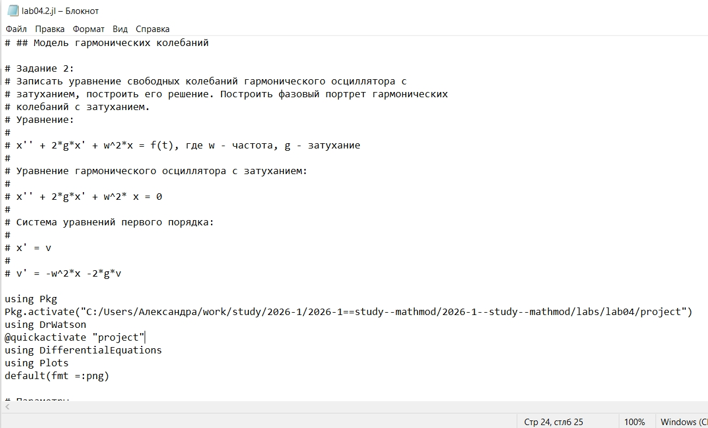{#fig-008 width=70%}

Запускаю скрипт командой "julia --project=. scripts/lab04.2.jl ([рис. @fig-009]).

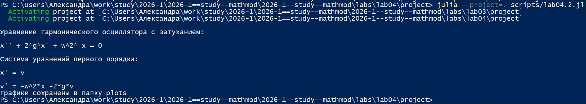{#fig-009 width=70%}

Просматриваю результирующий график в папке "plots" ([рис. @fig-010]).

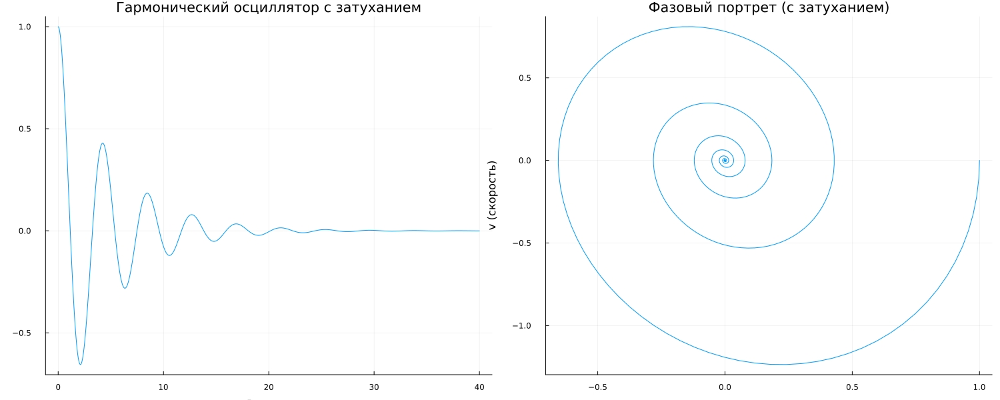{#fig-010 width=70%}

Генерирую чистый код, jupyter notebook и документацию в формате Quarto с помощью tangle.jl ([рис. @fig-011]).

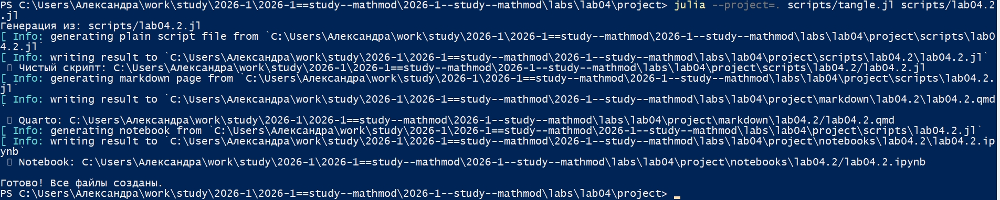{#fig-011 width=70%}

Открываю jupyter notebook и проверяю, что все коды успешно запускаются ([рис. @fig-012]).

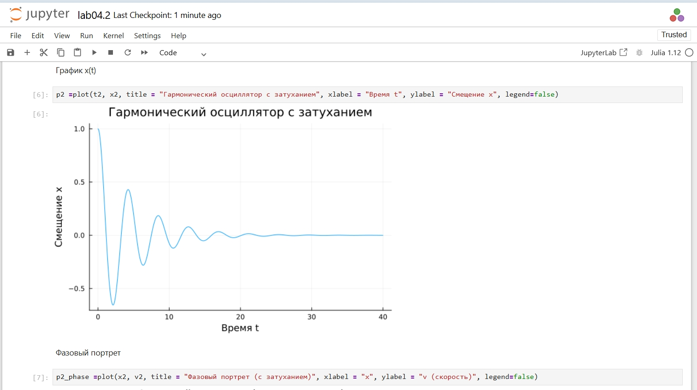{#fig-012 width=70%}

Для реализации построения решения уравнения гармонического осциллятора с затуханием, если на систему действует внешняя сила, а также построения фазового портрета колебаний с действием внешней силы создаю файл scripts/lab04.3.jl и записываю туда скрипт ([рис. @fig-013]).

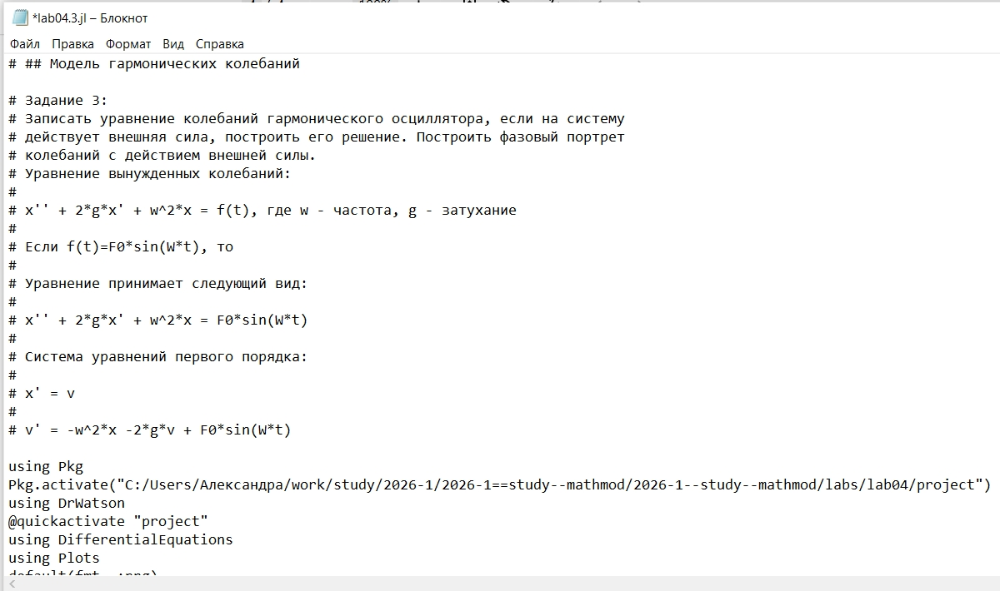{#fig-013 width=70%}

Запускаю скрипт командой "julia --project=. scripts/lab04.3.jl ([рис. @fig-014]).

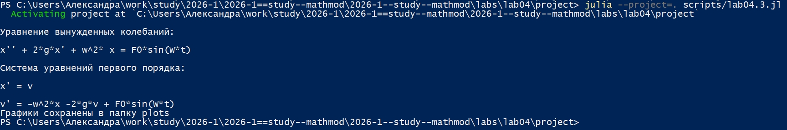{#fig-014 width=70%}

Просматриваю результирующий график в папке "plots" ([рис. @fig-015]).

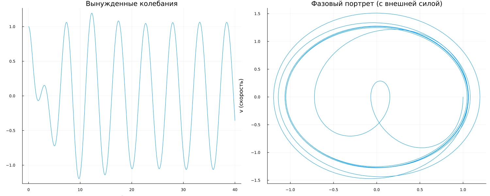{#fig-015 width=70%}

Генерирую чистый код, jupyter notebook и документацию в формате Quarto с помощью tangle.jl ([рис. @fig-016]).

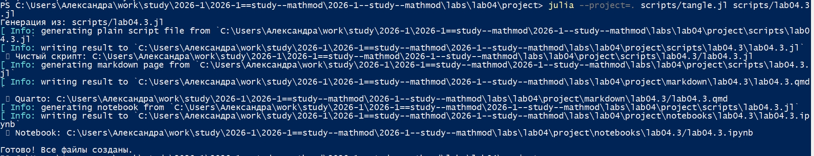{#fig-016 width=70%}

Открываю jupyter notebook и проверяю, что все коды успешно запускаются ([рис. @fig-017]).

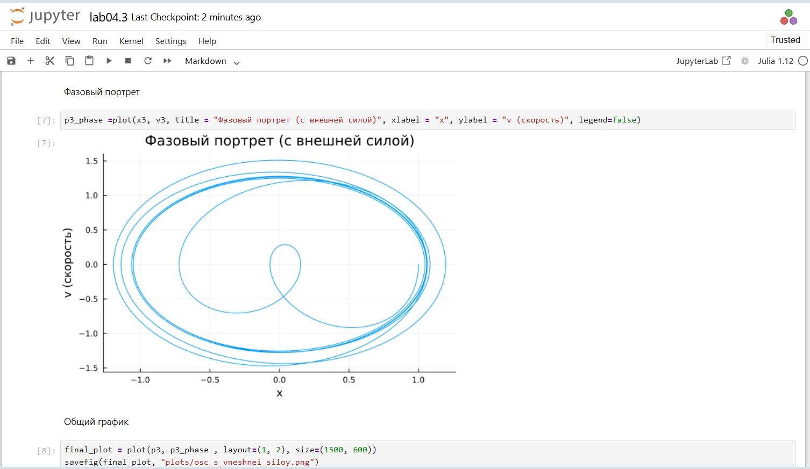{#fig-017 width=70%}

Для реализации построения фазового портрета гармонического осциллятора и решения уравнения гармонического осциллятора для случая: x'' + 7.4x = 0 создаю файл scripts/lab04_var25_1.jl и записываю туда скрипт ([рис. @fig-018]).

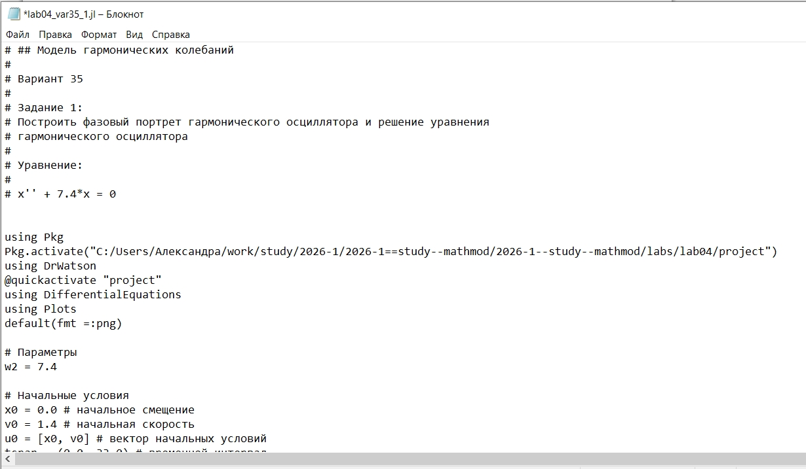{#fig-018 width=70%}

Просматриваю результирующий график в папке "plots" ([рис. @fig-019]).

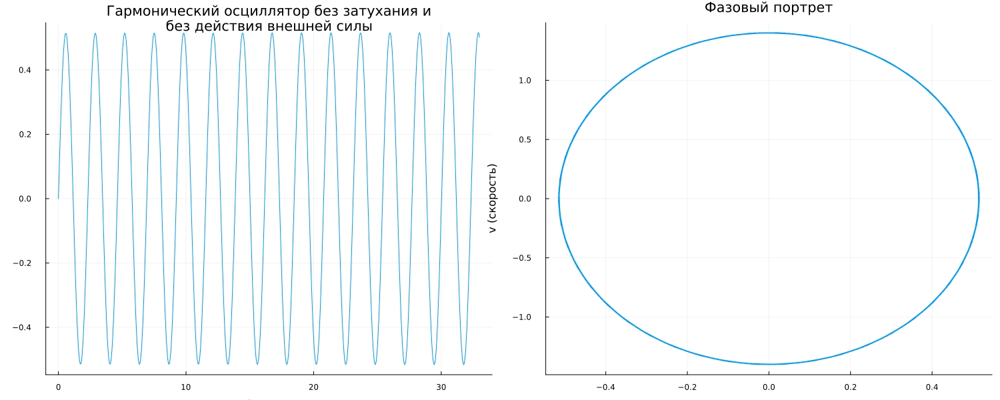{#fig-019 width=70%}

Генерирую чистый код, jupyter notebook и документацию в формате Quarto с помощью tangle.jl ([рис. @fig-020]).

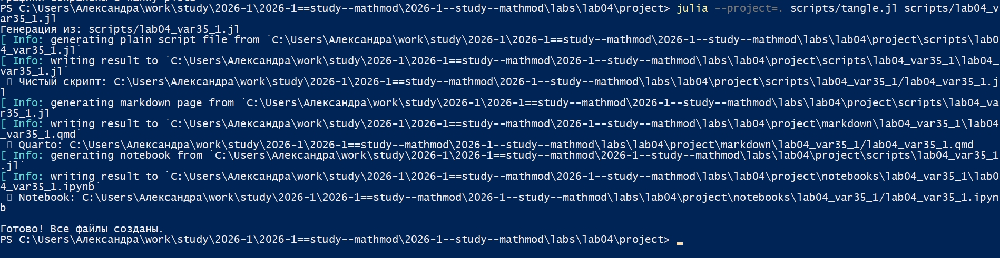{#fig-020 width=70%}

Открываю jupyter notebook и проверяю, что все коды успешно запускаются ([рис. @fig-021]).

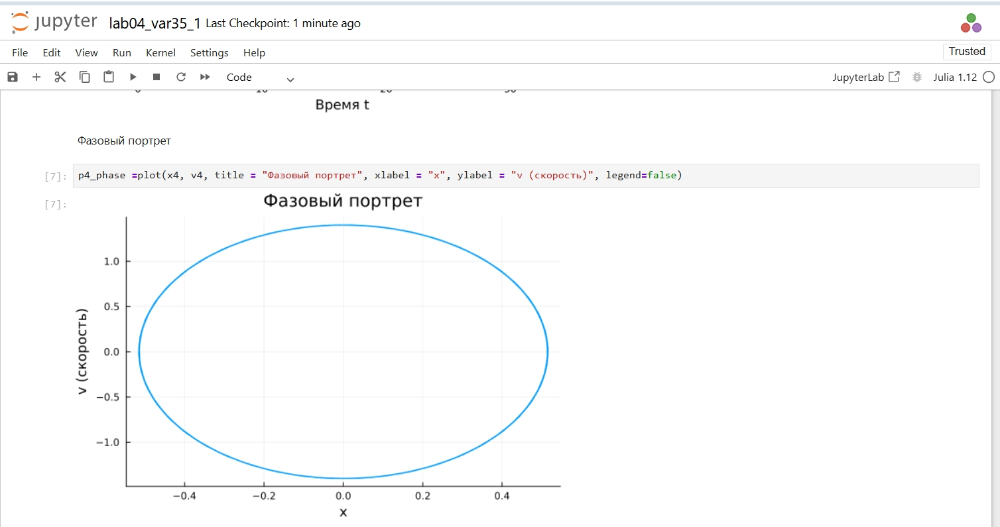{#fig-021 width=70%}

Для реализации построения фазового портрета гармонического осциллятора и решения уравнения гармонического осциллятора для случая: x'' + 10.1x' + 0.1x = 0 создаю файл scripts/lab04_var25_2.jl и записываю туда скрипт ([рис. @fig-022]).

{#fig-022 width=70%}

Запускаю скрипт ([рис. @fig-023]).

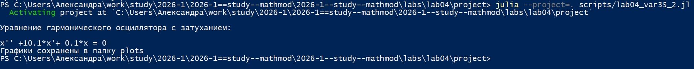{#fig-023 width=70%}

Просматриваю результирующий график в папке "plots" ([рис. @fig-024]).

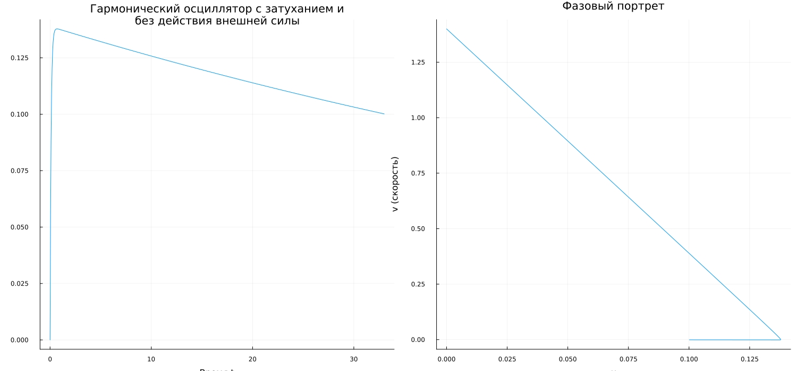{#fig-024 width=70%}

Генерирую чистый код, jupyter notebook и документацию в формате Quarto с помощью tangle.jl ([рис. @fig-025]).

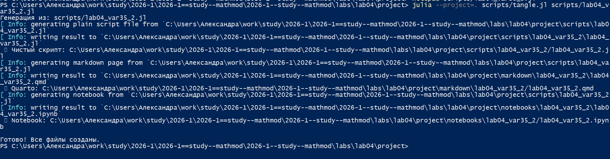{#fig-025 width=70%}

Открываю jupyter notebook и проверяю, что все коды успешно запускаются ([рис. @fig-026]).

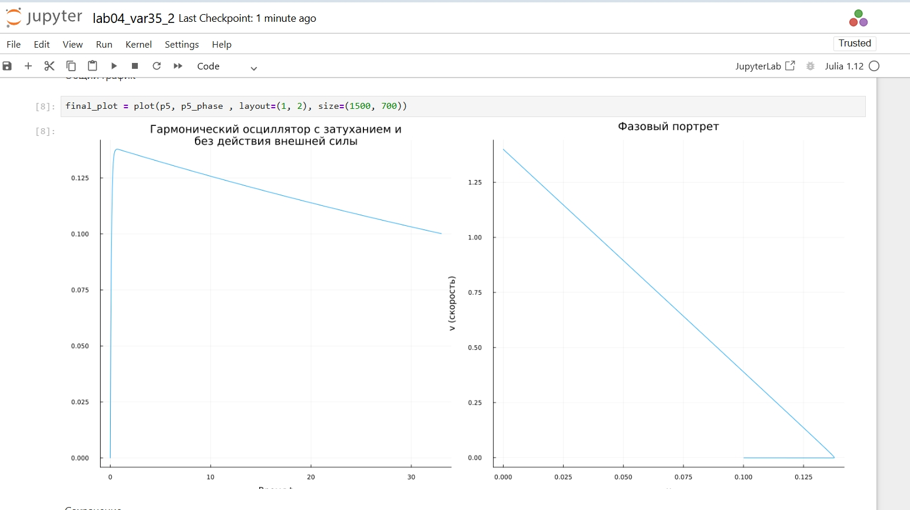{#fig-026 width=70%}

Для реализации построения фазового портрета гармонического осциллятора и решения уравнения гармонического осциллятора для случая: x'' + 3x' + 3.3x = 0.2sin(3.5t) создаю файл scripts/lab04_var25_3.jl и записываю туда скрипт ([рис. @fig-027]).

{#fig-027 width=70%}

Запускаю скрипт ([рис. @fig-028]).

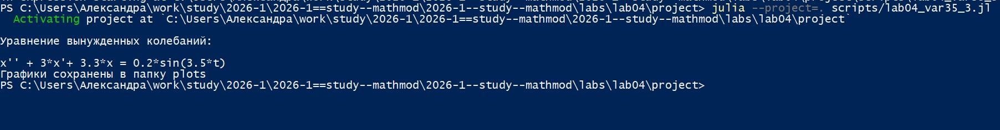{#fig-028 width=70%}

Просматриваю результирующий график в папке "plots" ([рис. @fig-029]).

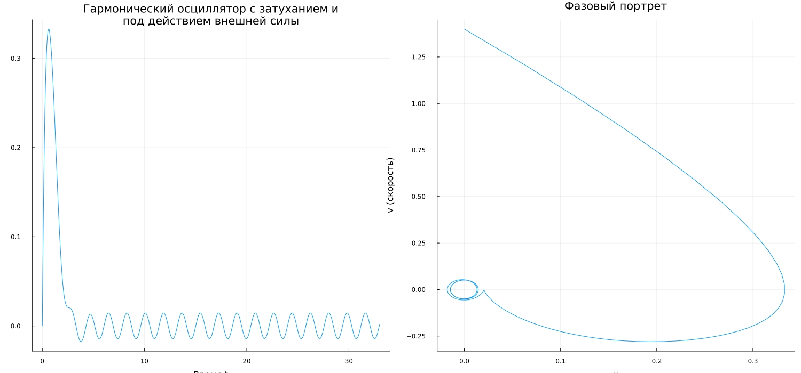{#fig-029 width=70%}

Генерирую чистый код, jupyter notebook и документацию в формате Quarto с помощью tangle.jl ([рис. @fig-030]).

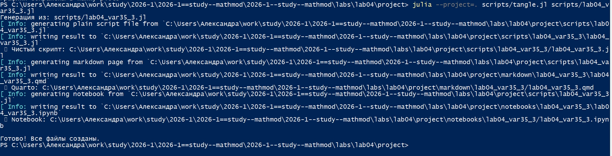{#fig-030 width=70%}

Открываю jupyter notebook и проверяю, что все коды успешно запускаются ([рис. @fig-031]).

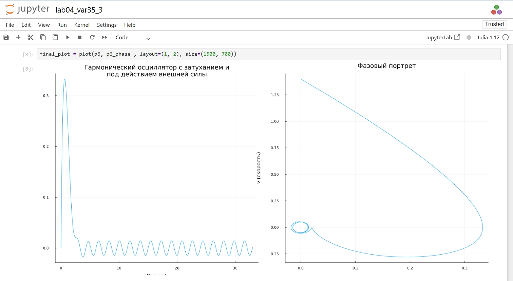{#fig-031 width=70%}

## Ответы на вопросы к лабораторной работе №4

### 1. Простейшая модель гармонических колебаний

$$ \ddot{x} + \omega_0^2 x = 0 $$

где $\omega_0$ — собственная частота колебаний.

### 2. Определение осциллятора

**Осциллятор** — физическая система, совершающая колебания около положения равновесия.

**Гармонический осциллятор** — система, в которой возвращающая сила пропорциональна смещению: $F = -kx$.

Примеры: грузик на пружине, математический маятник, колебательный контур.

### 3. Модель математического маятника

**Общий вид:**
$$ \ddot{\varphi} + \frac{g}{L}\sin\varphi = 0 $$

**При малых углах** ($\sin\varphi \approx \varphi$):
$$ \ddot{\varphi} + \frac{g}{L}\varphi = 0 $$

где $\varphi$ — угол отклонения, $L$ — длина нити, $g$ — ускорение свободного падения.

### 4. Алгоритм перехода от ДУ 2-го порядка к системе ДУ 1-го порядка

Исходное уравнение: $\ddot{x} = F(t, x, \dot{x})$

**Шаги:**

1. Ввести новую переменную: $v = \dot{x}$
2. Выразить производную: $\dot{v} = \ddot{x} = F(t, x, v)$
3. Получить систему:
   $$ \begin{cases} \dot{x} = v \\ \dot{v} = F(t, x, v) \end{cases} $$
4. Записать начальные условия:
   $$ \begin{cases} x(t_0) = x_0 \\ v(t_0) = v_0 = \dot{x}(t_0) \end{cases} $$

### 5. Фазовый портрет и фазовая траектория

**Фазовая плоскость** — пространство с координатами $(x, v)$, где $v = \dot{x}$.

**Фазовая траектория** — кривая на фазовой плоскости, описывающая изменение состояния системы во времени.

**Фазовый портрет** — совокупность всех фазовых траекторий для разных начальных условий.

| Тип осциллятора | Фазовый портрет |
|----------------|-----------------|
| Без затухания | Замкнутые эллипсы |
| С затуханием | Сходящиеся спирали |
| С внешней силой | Предельные циклы |













# Выводы

В ходе выполнения лабораторной работы были построены решения и фазовые портреты гармонического осциллятора для трёх случаев: без затухания, с затуханием и при действии внешней силы. Освоены методы численного решения дифференциальных уравнений в Julia и визуализации фазовых траекторий.

# Список литературы{.unnumbered}

1. Королькова А. В., Кулябов Д. С. Математическое моделирование. Практикум : учебное пособие. — М. : РУДН, 2026. — 87 с.

2. DifferentialEquations.jl: Efficient Differential Equation Solving in Julia. — URL: https://diffeq.sciml.ai/stable/ (дата обращения: 27.08.2026).

3. Plots.jl: Powerful convenience for Julia visualizations. — URL: https://docs.juliaplots.org/stable/ (дата обращения: 27.08.2026).

4. DrWatson.jl: Scientific project assistant software. — URL: https://juliadynamics.github.io/DrWatson.jl/stable/ (дата обращения: 27.08.2026).

