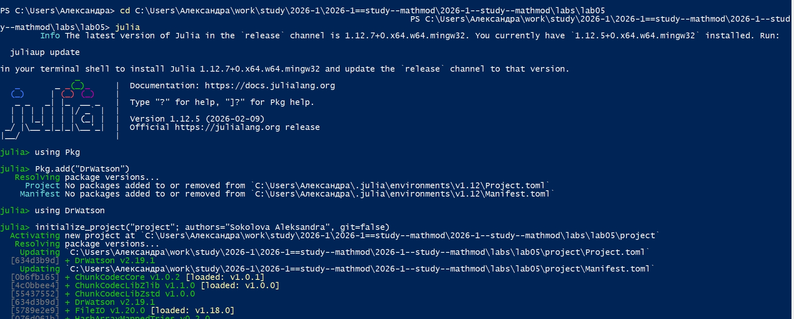
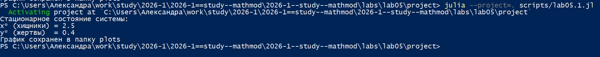
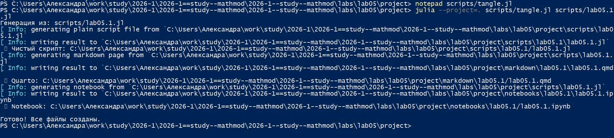
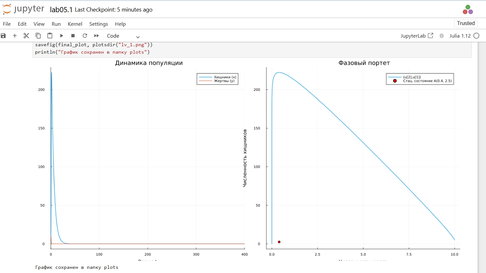
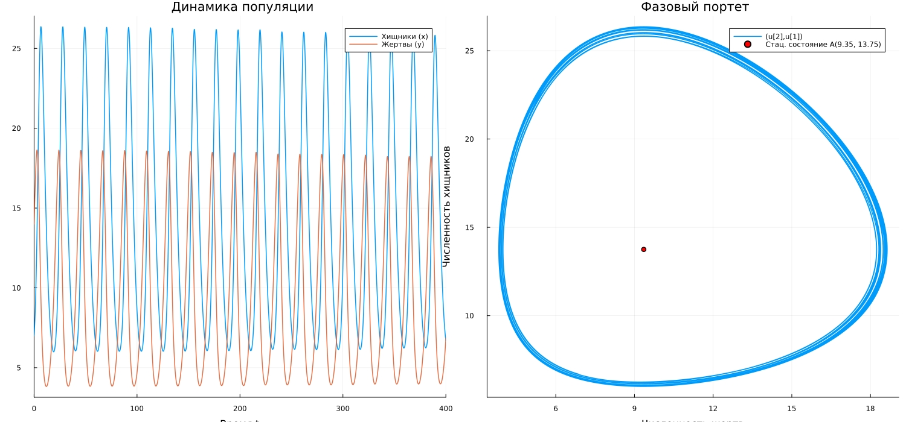
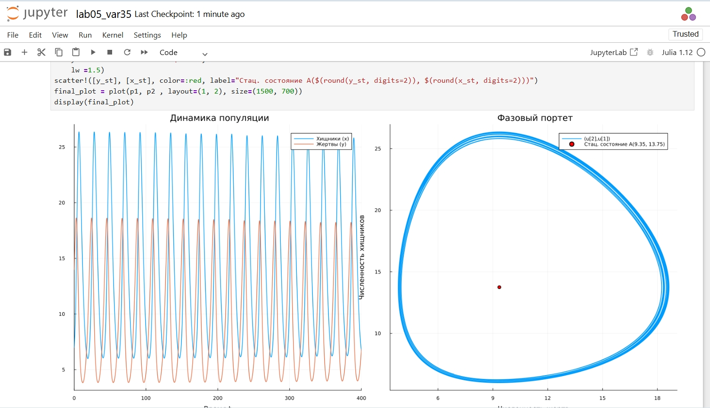

---
## Author
author:
  name: Соколова Александра Олеговна
  degrees: DSc
  orcid: 0000-0002-0877-7063
  email: 1132236034s@rudn.ru
  affiliation:
    - name: Российский университет дружбы народов
      country: Российская Федерация
      postal-code: 117198
      city: Москва
      address: ул. Миклухо-Маклая, д. 6
## Title
title: Презентация по лабораторной работе №5
subtitle: Математическое моделирование
license: CC BY
date: today
date-format: "YYYY-MM-DD" # Example: 2025-09-06
---

## Цель работы

Построить графики зависимости численности популяций хищников и жертв для модели Лотки-Вольтерры, определить стационарное состояние системы, освоить методы численного решения систем дифференциальных уравнений в Julia и визуализации результатов моделирования.

## Выполнение лабораторной работы

Начинаю выполнение лабораторной с инициализации проекта DrWatson ([рис. @fig-001]).

{#fig-001 width=70%}

## Модель хищник-жертва

Для реализации модели хищник-жертва создаю файл scripts/lab05.1.jl и записываю туда скрипт ([рис. @fig-002]).

{#fig-002 width=70%}

## Модель хищник-жертва

Запускаю скрипт командой "julia --project=. scripts/lab05.1.jl. В консоль выводится стационарное состояние системы, результирующий график сохраняется в папку "plots" ([рис. @fig-003]).

{#fig-003 width=70%}

## Модель хищник-жертва

Просматриваю результирующий график в папке "plots" ([рис. @fig-004]).

{#fig-004 width=70%}

## Модель хищник-жертва

Создаю файл tangle.jl для дальнейшей генерации производных форматов ([рис. @fig-005]).

{#fig-005 width=70%}

## Модель хищник-жертва

Генерирую чистый код, jupyter notebook и документацию в формате Quarto с помощью tangle.jl ([рис. @fig-006]).

{#fig-006 width=70%}

## Модель хищник-жертва

Открываю jupyter notebook и проверяю, что все коды успешно запускаются ([рис. @fig-007]).

{#fig-007 width=70%}

## Модель хищник-жертва. Вариант 35

Для реализации задания из личного варианта 35 создаю файл scripts/lab05_var35.jl и записываю туда скрипт ([рис. @fig-008]).

{#fig-008 width=70%}

## Модель хищник-жертва. Вариант 35

Запускаю скрипт командой "julia --project=. scripts/lab05_var35.jl. В консоль выводится стационарное состояние системы, результирующий график сохраняется в папку "plots" ([рис. @fig-009]).

{#fig-009 width=70%}

## Модель хищник-жертва. Вариант 35

Просматриваю результирующий график в папке "plots" ([рис. @fig-010]).

{#fig-010 width=70%}

## Модель хищник-жертва. Вариант 35

Генерирую чистый код, jupyter notebook и документацию в формате Quarto с помощью tangle.jl ([рис. @fig-011]).

{#fig-011 width=70%}

## Модель хищник-жертва. Вариант 35

Открываю jupyter notebook и проверяю, что все коды успешно запускаются ([рис. @fig-012]).

{#fig-012 width=70%}

## Выводы

В ходе выполнения лабораторной работы были построены графики зависимости численности хищников от численности жертв (фазовые портреты) и графики изменения численности хищников и жертв во времени для модели Лотки-Вольтерры. Для общего задания и для индивидуального варианта 35 были найдены стационарные состояния систем.

Установлено, что модель Лотки-Вольтерры демонстрирует периодические колебания численности популяций, причём колебания происходят в противофазе. Фазовые траектории системы являются замкнутыми кривыми, что соответствует сохранению периодического характера динамики.

