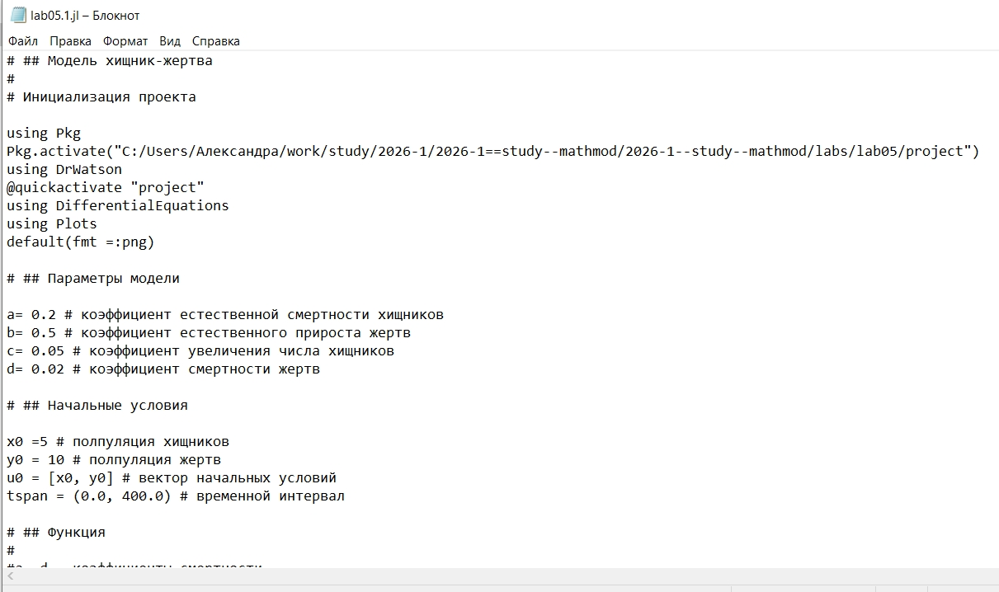
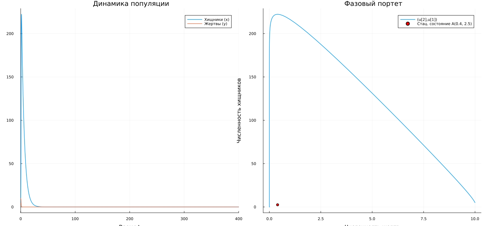
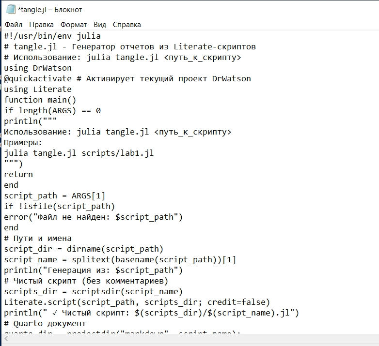
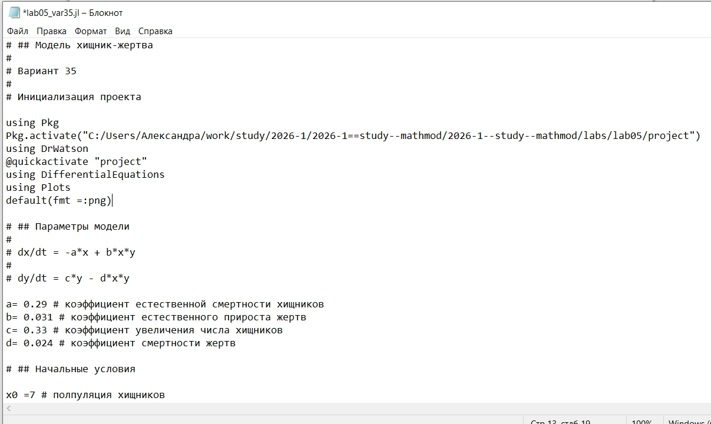
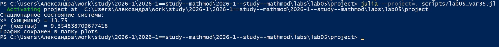
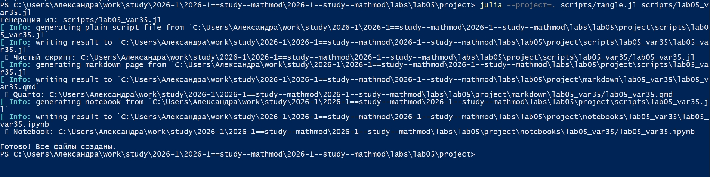

---
## Author
author:
  name: Соколова Александра Олеговна
  degrees: DSc
  orcid: 0000-0002-0877-7063
  email: 1132236034@rudn.ru
  affiliation:
    - name: Российский университет дружбы народов
      country: Российская Федерация
      postal-code: 117198
      city: Москва
      address: ул. Миклухо-Маклая, д. 6

## Title
title: "Отчёт по лабораторной работе №5"
subtitle: "Математическое моделирование"
license: "CC BY"
---

# Цель работы

Построить графики зависимости численности популяций хищников и жертв для модели Лотки-Вольтерры, определить стационарное состояние системы, освоить методы численного решения систем дифференциальных уравнений в Julia и визуализации результатов моделирования.

# Задание

## Общее задание

Для модели «хищник-жертва», описываемой системой дифференциальных уравнений:

$$ \begin{cases} \frac{dx}{dt} = -ax(t) + bx(t)y(t) \\ \frac{dy}{dt} = cy(t) - dx(t)y(t) \end{cases} $$

где:
- $x$ — численность хищников;
- $y$ — численность жертв;
- $a$ — коэффициент смертности хищников;
- $b$ — коэффициент прироста хищников (зависит от встреч с жертвами);
- $c$ — коэффициент прироста жертв;
- $d$ — коэффициент смертности жертв;

необходимо:

1. Построить график зависимости численности хищников от численности жертв (фазовый портрет) и графики функций $x(t)$, $y(t)$.

2. Найти стационарное состояние системы.

## Вариант 35 

Для модели «хищник-жертва»:

$$ \begin{cases} \frac{dx}{dt} = -0.29x(t) + 0.031x(t)y(t) \\ \frac{dy}{dt} = 0.33y(t) - 0.024x(t)y(t) \end{cases} $$

Построить график зависимости численности хищников от численности жертв, а также графики изменения численности хищников и численности жертв при следующих начальных условиях: $x_0 = 7$, $y_0 = 14$. Найти стационарное состояние системы.

# Теоретическое введение

## Модель Лотки-Вольтерры

Модель Лотки-Вольтерры — одна из классических математических моделей, описывающих динамику взаимодействия двух популяций: хищников и жертв. Данная модель основывается на следующих предположениях:

1. Численность популяции жертв $x$ и хищников $y$ зависят только от времени (модель не учитывает пространственное распределение популяции на занимаемой территории).

2. В отсутствии взаимодействия численность видов изменяется по модели Мальтуса, при этом число жертв увеличивается, а число хищников падает.

3. Естественная смертность жертвы и естественная рождаемость хищника считаются несущественными.

4. Эффект насыщения численности обеих популяций не учитывается.

Система уравнений модели имеет вид:

$$ \begin{cases} \frac{dx}{dt} = ax(t) - bx(t)y(t) \\ \frac{dy}{dt} = -cy(t) + dx(t)y(t) \end{cases} $$

где:
- $a$ — коэффициент естественного прироста жертв в отсутствие хищников;
- $b$ — коэффициент, описывающий вероятность встречи хищника с жертвой;
- $c$ — коэффициент естественного вымирания хищников;
- $d$ — коэффициент, описывающий увеличение популяции хищников при встрече с жертвами.

В рассматриваемой модели (в соответствии с заданием) используются следующие обозначения:
- $a$ — коэффициент смертности хищников;
- $b$ — коэффициент прироста хищников (зависит от встреч с жертвами);
- $c$ — коэффициент прироста жертв;
- $d$ — коэффициент смертности жертв.

Тогда система принимает вид:

$$ \begin{cases} \frac{dx}{dt} = -ax(t) + bx(t)y(t) \\ \frac{dy}{dt} = cy(t) - dx(t)y(t) \end{cases} $$

где $x$ — численность хищников, $y$ — численность жертв.

## Стационарное состояние

Стационарным состоянием системы называется такое состояние, при котором численности популяций не изменяются со временем, то есть:

$$ \frac{dx}{dt} = 0, \quad \frac{dy}{dt} = 0 $$

Решая систему уравнений:

$$ \begin{cases} -ax + bxy = 0 \\ cy - dxy = 0 \end{cases} $$

получаем два решения:

1. Тривиальное: $x = 0$, $y = 0$ (вымирание обеих популяций).

2. Нетривиальное: $$ x^* = \frac{c}{d}, \quad y^* = \frac{a}{b} $$

Нетривиальное стационарное состояние соответствует сосуществованию обоих видов.

## Фазовый портрет

Фазовый портрет системы представляет собой график зависимости численности хищников от численности жертв (или наоборот). В модели Лотки-Вольтерры фазовые траектории являются замкнутыми кривыми, что соответствует периодическим колебаниям численности популяций.

# Выполнение лабораторной работы

Начинаю выполнение лабораторной с инициализации проекта DrWatson ([рис. @fig-001]).

{#fig-001 width=70%}

Для реализации модели хищник-жертва создаю файл scripts/lab05.1.jl и записываю туда скрипт ([рис. @fig-002]).

{#fig-002 width=70%}

Запускаю скрипт командой "julia --project=. scripts/lab05.1.jl. В консоль выводится стационарное состояние системы, результирующий график сохраняется в папку "plots" ([рис. @fig-003]).

{#fig-003 width=70%}

Просматриваю результирующий график в папке "plots" ([рис. @fig-004]).

{#fig-004 width=70%}

Создаю файл tangle.jl для дальнейшей генерации производных форматов ([рис. @fig-005]).

{#fig-005 width=70%}

Генерирую чистый код, jupyter notebook и документацию в формате Quarto с помощью tangle.jl ([рис. @fig-006]).

{#fig-006 width=70%}

Открываю jupyter notebook и проверяю, что все коды успешно запускаются ([рис. @fig-007]).

{#fig-007 width=70%}

Для реализации задания из личного варианта 35 создаю файл scripts/lab05_var35.jl и записываю туда скрипт ([рис. @fig-008]).

{#fig-008 width=70%}

Запускаю скрипт командой "julia --project=. scripts/lab05_var35.jl. В консоль выводится стационарное состояние системы, результирующий график сохраняется в папку "plots" ([рис. @fig-009]).

{#fig-009 width=70%}

Просматриваю результирующий график в папке "plots" ([рис. @fig-010]).

{#fig-010 width=70%}

Генерирую чистый код, jupyter notebook и документацию в формате Quarto с помощью tangle.jl ([рис. @fig-011]).

{#fig-011 width=70%}

Открываю jupyter notebook и проверяю, что все коды успешно запускаются ([рис. @fig-012]).

{#fig-012 width=70%}





# Выводы

В ходе выполнения лабораторной работы были построены графики зависимости численности хищников от численности жертв (фазовые портреты) и графики изменения численности хищников и жертв во времени для модели Лотки-Вольтерры. Для общего задания и для индивидуального варианта 35 были найдены стационарные состояния систем.

Установлено, что модель Лотки-Вольтерры демонстрирует периодические колебания численности популяций, причём колебания происходят в противофазе. Фазовые траектории системы являются замкнутыми кривыми, что соответствует сохранению периодического характера динамики.

# Список литературы{.unnumbered}

1. Королькова А. В., Кулябов Д. С. Математическое моделирование. Практикум : учебное пособие. — М. : РУДН, 2026. — 87 с.

2. DifferentialEquations.jl: Efficient Differential Equation Solving in Julia. — URL: https://diffeq.sciml.ai/stable/ (дата обращения: 04.09.2026).

3. Plots.jl: Powerful convenience for Julia visualizations. — URL: https://docs.juliaplots.org/stable/ (дата обращения: 04.09.2026).

4. DrWatson.jl: Scientific project assistant software. — URL: https://juliadynamics.github.io/DrWatson.jl/stable/ (дата обращения: 04.09.2026).
