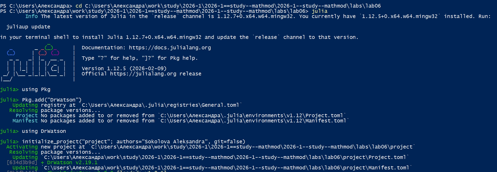
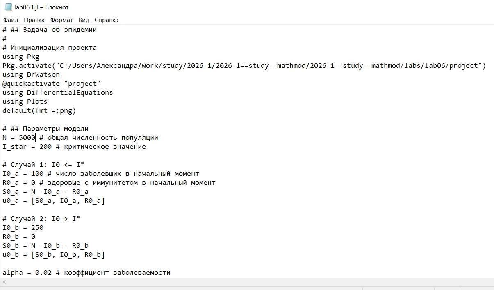
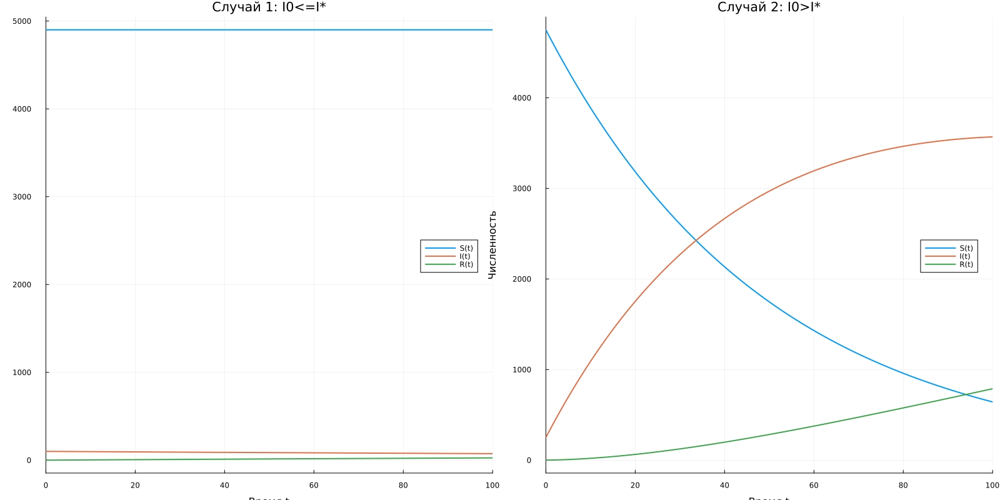
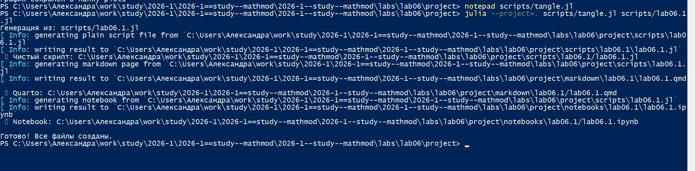
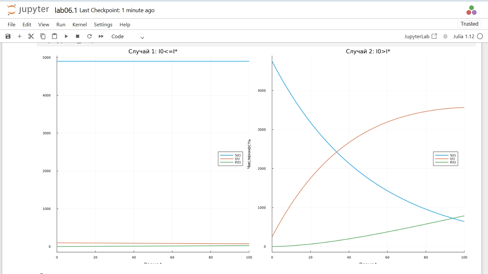
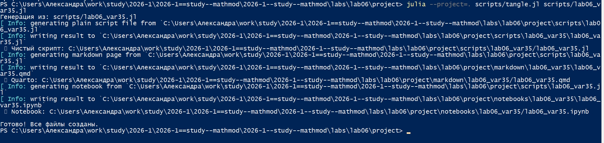
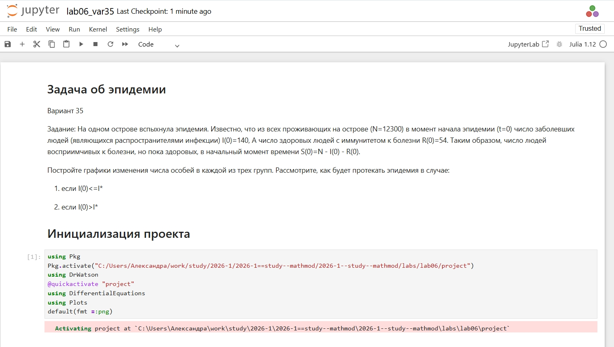

---
## Author
author:
  name: Соколова Александра Олеговна
  degrees: DSc
  orcid: 0000-0002-0877-7063
  email: 1132236034s@rudn.ru
  affiliation:
    - name: Российский университет дружбы народов
      country: Российская Федерация
      postal-code: 117198
      city: Москва
      address: ул. Миклухо-Маклая, д. 6
## Title
title: Презентация по лабораторной работе №6
subtitle: Математическое моделирование
license: CC BY
date: today
date-format: "YYYY-MM-DD" # Example: 2025-09-06
---

## Цель работы

Построить графики изменения числа особей в каждой из трех групп (восприимчивые S(t), инфицированные I(t), здоровые с иммунитетом R(t)) для модели эпидемии в двух случаях: когда начальное число инфицированных не превышает критическое значение I(0) ≤ I* и когда превышает I(0) > I*.

## Выполнение лабораторной работы

Начинаю выполнение лабораторной с инициализации проекта DrWatson ([рис. @fig-001]).

{#fig-001 width=70%}

## Задача об эпидемии

Для реализации задачи об эпидемии создаю файл scripts/lab06.1.jl и записываю туда скрипт ([рис. @fig-002]).

{#fig-002 width=70%}

## Задача об эпидемии

Просматриваю результирующий график в папке "plots" ([рис. @fig-003]).

{#fig-003 width=70%}

## Задача об эпидемии

Создаю файл tangle.jl для дальнейшей генерации производных форматов ([рис. @fig-004]).

{#fig-004 width=70%}

## Задача об эпидемии

Генерирую чистый код, jupyter notebook и документацию в формате Quarto с помощью tangle.jl ([рис. @fig-005]).

{#fig-005 width=70%}

## Задача об эпидемии

Открываю jupyter notebook и проверяю, что все коды успешно запускаются ([рис. @fig-006]).

{#fig-006 width=70%}

## Задача об эпидемии. Вариант 35

Для реализации задания из личного варианта 35 создаю файл scripts/lab06_var35.jl и записываю туда скрипт ([рис. @fig-007]).

{#fig-007 width=70%}

## Задача об эпидемии. Вариант 35

Просматриваю результирующий график в папке "plots" ([рис. @fig-008]).

{#fig-008 width=70%}

## Задача об эпидемии. Вариант 35

Генерирую чистый код, jupyter notebook и документацию в формате Quarto с помощью tangle.jl ([рис. @fig-009]).

{#fig-009 width=70%}

## Задача об эпидемии. Вариант 35

Открываю jupyter notebook и проверяю, что все коды успешно запускаются ([рис. @fig-010]).

{#fig-010 width=70%}

## Выводы

В ходе выполнения лабораторной работы была реализована модель эпидемии для популяции N = 12300 особей с начальными условиями I(0) = 140, R(0) = 54, S(0) = 12106.

Рассмотрены два сценария развития эпидемии:

1. При I(0) ≤ I* (I* = 200) эпидемия не развивается — больные изолированы, количество инфицированных монотонно убывает до нуля, популяция восприимчивых остается неизменной.

2. При I(0) > I* (I* = 100) происходит активное распространение инфекции — восприимчивые заражаются, число инфицированных сначала растет, достигает максимума, а затем снижается за счет выздоровления.

Таким образом, критическое значение I* является важным параметром, определяющим характер протекания эпидемии: его превышение приводит к переходу от режима изоляции к режиму активного распространения инфекции.
