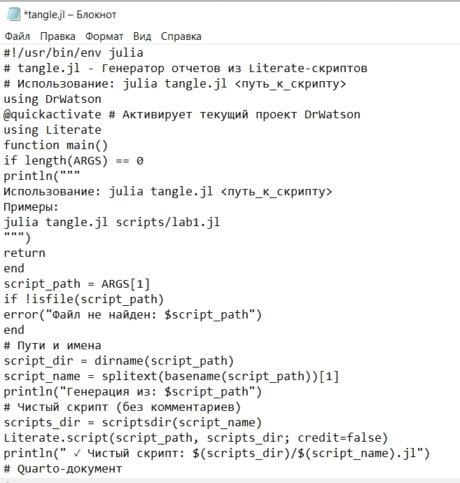
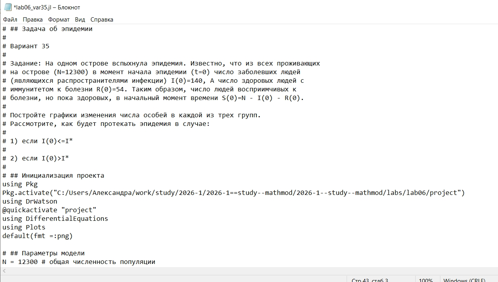
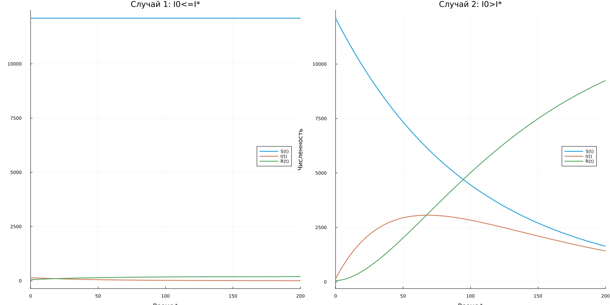

---
## Author
author:
  name: Соколова Александра Олеговна
  degrees: DSc
  orcid: 0000-0002-0877-7063
  email: 1132236034@rudn.ru
  affiliation:
    - name: Российский университет дружбы народов
      country: Российская Федерация
      postal-code: 117198
      city: Москва
      address: ул. Миклухо-Маклая, д. 6

## Title
title: "Отчёт по лабораторной работе №6"
subtitle: "Математическое моделирование"
license: "CC BY"
---

# Цель работы

Построить графики изменения числа особей в каждой из трех групп (восприимчивые S(t), инфицированные I(t), здоровые с иммунитетом R(t)) для модели эпидемии в двух случаях: когда начальное число инфицированных не превышает критическое значение I(0) ≤ I* и когда превышает I(0) > I*.

# Задание

Рассмотреть простейшую модель эпидемии. Популяция, состоящая из N особей, подразделяется на три группы:

- S(t) — восприимчивые к болезни, но пока здоровые особи;
- I(t) — инфицированные особи, являющиеся распространителями инфекции;
- R(t) — здоровые особи с иммунитетом к болезни.

До того, как число заболевших не превышает критического значения I*, считаем, что все больные изолированы и не заражают здоровых. Когда I(t) > I*, инфицированные способны заражать восприимчивых к болезни особей.

Скорость изменения числа S(t) меняется по закону:

$$ \frac{dS}{dt} = \begin{cases} -\alpha S, & \text{если } I(t) > I^* \\ 0, & \text{если } I(t) \leq I^* \end{cases} $$

Скорость изменения числа инфекционных особей:

$$ \frac{dI}{dt} = \begin{cases} \alpha S - \beta I, & \text{если } I(t) > I^* \\ -\beta I, & \text{если } I(t) \leq I^* \end{cases} $$

Скорость изменения выздоравливающих особей:

$$ \frac{dR}{dt} = \beta I $$

где α — коэффициент заболеваемости, β — коэффициент выздоровления.

**Вариант 35:**

На одном острове вспыхнула эпидемия. Известно, что из всех проживающих на острове (N = 12 300) в момент начала эпидемии (t = 0) число заболевших людей (являющихся распространителями инфекции) I(0) = 140, а число здоровых людей с иммунитетом к болезни R(0) = 54. Число людей восприимчивых к болезни, но пока здоровых, в начальный момент времени S(0) = N - I(0) - R(0).

Постройте графики изменения числа особей в каждой из трех групп. Рассмотрите, как будет протекать эпидемия в случае:

1) если I(0) ≤ I*;

2) если I(0) > I*.

# Теоретическое введение

## Модель эпидемии

Модель эпидемии (SIR-модель) — одна из классических моделей математической эпидемиологии, описывающая распространение инфекционного заболевания в популяции. В основе модели лежит разделение популяции на три группы (компартмента): восприимчивые (Susceptible) — S, инфицированные (Infectious) — I, и выздоровевшие с иммунитетом (Recovered) — R.

SIR-модель была предложена в 1927 году Кермаком и Маккендриком и до сих пор широко используется для анализа эпидемических процессов, включая моделирование распространения гриппа, кори, COVID-19 и других инфекционных заболеваний.

## Математическая постановка задачи

В рассматриваемой модели предполагается, что:

1. Популяция изолирована (нет миграции), и общая численность N = S(t) + I(t) + R(t) постоянна.
2. Инфицированные особи I(t) могут заражать восприимчивых S(t) при контакте.
3. Заболевшие либо выздоравливают и приобретают иммунитет, переходя в группу R(t).
4. Существует критическое значение I*, определяющее порог изоляции больных.

Параметры модели:
- **α** — коэффициент заболеваемости, характеризующий скорость передачи инфекции;
- **β** — коэффициент выздоровления, определяющий скорость перехода из группы I в группу R;
- **I*** — критическое значение числа инфицированных, при превышении которого начинается активное распространение эпидемии.

## Особенности модели с изоляцией

Важной особенностью рассматриваемой модели является наличие порогового значения I*. Это отражает реальную практику карантинных мероприятий: пока число заболевших невелико, их изолируют, и распространение инфекции не происходит. Когда число инфицированных превышает критический порог, изоляция становится неэффективной, и начинается эпидемия.

При I(t) ≤ I* система уравнений упрощается:
- S(t) остается постоянным, так как здоровые не заражаются;
- I(t) уменьшается со скоростью β·I за счет выздоровления;
- R(t) увеличивается за счет выздоравливающих.

При I(t) > I* система становится нелинейной:
- S(t) уменьшается со скоростью α·S;
- I(t) изменяется под действием двух процессов: заражения (α·S) и выздоровления (β·I);
- R(t) пополняется за счет выздоравливающих.

# Выполнение лабораторной работы

Начинаю выполнение лабораторной с инициализации проекта DrWatson ([рис. @fig-001]).

{#fig-001 width=70%}

Для реализации задачи об эпидемии создаю файл scripts/lab06.1.jl и записываю туда скрипт ([рис. @fig-002]).

{#fig-002 width=70%}

Просматриваю результирующий график в папке "plots" ([рис. @fig-003]).

{#fig-003 width=70%}

Создаю файл tangle.jl для дальнейшей генерации производных форматов ([рис. @fig-004]).

{#fig-004 width=70%}

Генерирую чистый код, jupyter notebook и документацию в формате Quarto с помощью tangle.jl ([рис. @fig-005]).

{#fig-005 width=70%}

Открываю jupyter notebook и проверяю, что все коды успешно запускаются ([рис. @fig-006]).

{#fig-006 width=70%}

Для реализации задания из личного варианта 35 создаю файл scripts/lab06_var35.jl и записываю туда скрипт ([рис. @fig-007]).

{#fig-007 width=70%}

Просматриваю результирующий график в папке "plots" ([рис. @fig-008]).

{#fig-008 width=70%}

Генерирую чистый код, jupyter notebook и документацию в формате Quarto с помощью tangle.jl ([рис. @fig-009]).

{#fig-009 width=70%}

Открываю jupyter notebook и проверяю, что все коды успешно запускаются ([рис. @fig-010]).

{#fig-010 width=70%}





# Выводы

В ходе выполнения лабораторной работы была реализована модель эпидемии для популяции N = 12300 особей с начальными условиями I(0) = 140, R(0) = 54, S(0) = 12106.

Рассмотрены два сценария развития эпидемии:

1. При I(0) ≤ I* (I* = 200) эпидемия не развивается — больные изолированы, количество инфицированных монотонно убывает до нуля, популяция восприимчивых остается неизменной.

2. При I(0) > I* (I* = 100) происходит активное распространение инфекции — восприимчивые заражаются, число инфицированных сначала растет, достигает максимума, а затем снижается за счет выздоровления.

Таким образом, критическое значение I* является важным параметром, определяющим характер протекания эпидемии: его превышение приводит к переходу от режима изоляции к режиму активного распространения инфекции.

# Список литературы{.unnumbered}

1. Королькова А. В., Кулябов Д. С. Математическое моделирование. Практикум : учебное пособие. — М. : РУДН, 2026. — 87 с.

2. DifferentialEquations.jl: Efficient Differential Equation Solving in Julia. — URL: https://diffeq.sciml.ai/stable/ (дата обращения: 03.09.2026).

3. Plots.jl: Powerful convenience for Julia visualizations. — URL: https://docs.juliaplots.org/stable/ (дата обращения: 03.09.2026).

4. DrWatson.jl: Scientific project assistant software. — URL: https://juliadynamics.github.io/DrWatson.jl/stable/ (дата обращения: 03.09.2026).

5. Kermack W. O., McKendrick A. G. A Contribution to the Mathematical Theory of Epidemics // Proceedings of the Royal Society A. — 1927. — Vol. 115, No. 772. — P. 700–721.

