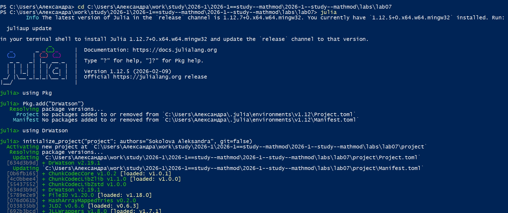
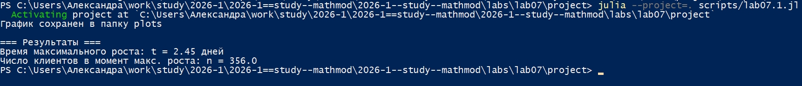
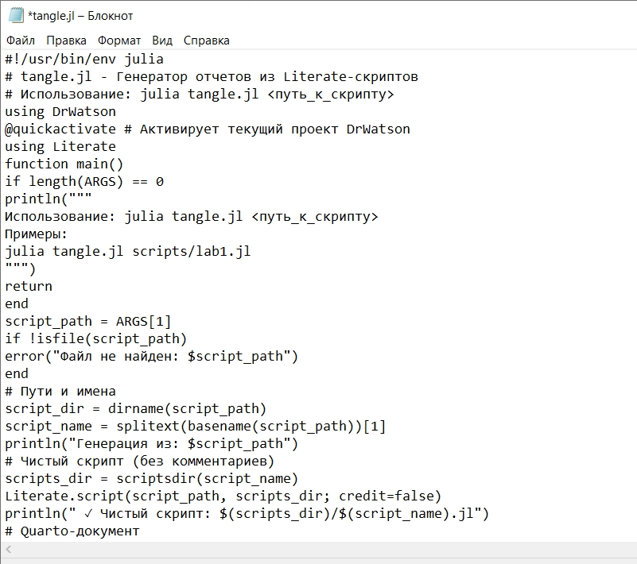
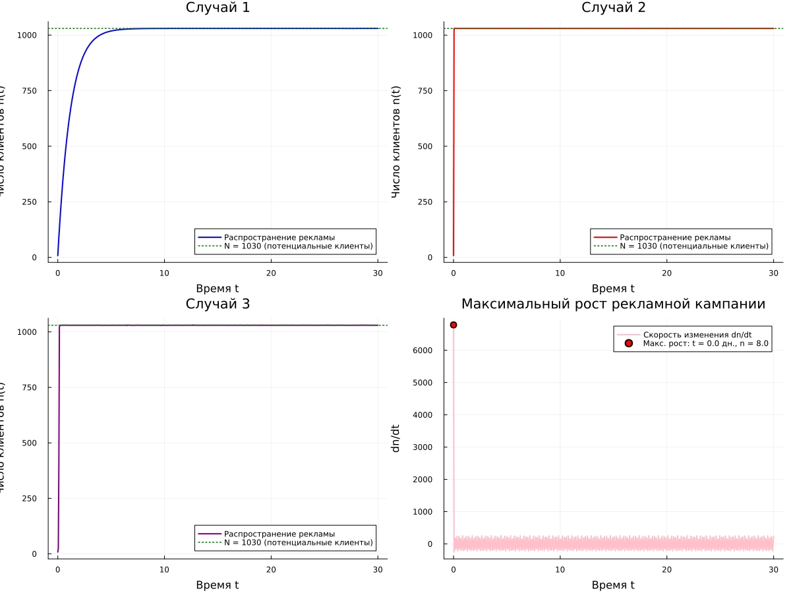
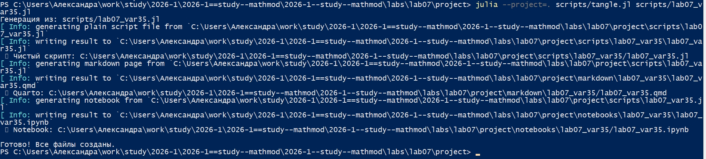

---
## Author
author:
  name: Соколова Александра Олеговна
  degrees: DSc
  orcid: 0000-0002-0877-7063
  email: 1132236034s@rudn.ru
  affiliation:
    - name: Российский университет дружбы народов
      country: Российская Федерация
      postal-code: 117198
      city: Москва
      address: ул. Миклухо-Маклая, д. 6
## Title
title: Презентация по лабораторной работе №7
subtitle: Математическое моделирование
license: CC BY
date: today
date-format: "YYYY-MM-DD" # Example: 2025-09-06
---

## Цель работы

Построить график распространения рекламы для различных сценариев рекламной кампании на основе математической модели, описываемой дифференциальным уравнением. Определить момент времени, когда скорость распространения рекламы достигает максимального значения. Освоить методы численного решения дифференциальных уравнений в Julia и визуализации результатов моделирования.

## Выполнение лабораторной работы

Начинаю выполнение лабораторной с инициализации проекта DrWatson ([рис. @fig-001]).

{#fig-001 width=70%}

## Модель эффективности рекламы

Для реализации модели эффективности рекламы создаю файл scripts/lab07.1.jl и записываю туда скрипт ([рис. @fig-002]).

{#fig-002 width=70%}

## Модель эффективности рекламы

Запускаю скрипт командой "julia --project=. scripts/lab07.1.jl ([рис. @fig-003]).

{#fig-003 width=70%}

## Модель эффективности рекламы

Просматриваю результирующий график в папке "plots" ([рис. @fig-004]).

{#fig-004 width=70%}

## Модель эффективности рекламы

Создаю файл tangle.jl для дальнейшей генерации производных форматов ([рис. @fig-005]).

{#fig-005 width=70%}

## Модель эффективности рекламы

Генерирую чистый код, jupyter notebook и документацию в формате Quarto с помощью tangle.jl ([рис. @fig-006]).

{#fig-006 width=70%}

## Модель эффективности рекламы

Открываю jupyter notebook и проверяю, что все коды успешно запускаются ([рис. @fig-007]).

{#fig-007 width=70%}

## Модель эффективности рекламы. Вариант 35

Для реализации задания из личного варианта 35 создаю файл scripts/lab07_var35.jl и записываю туда скрипт ([рис. @fig-008]).

{#fig-008 width=70%}

## Модель эффективности рекламы. Вариант 35

Запускаю скрипт командой "julia --project=. scripts/lab07_var35.jl ([рис. @fig-009]).

{#fig-009 width=70%}

## Модель эффективности рекламы. Вариант 35

Просматриваю результирующий график в папке "plots" ([рис. @fig-010]).

{#fig-010 width=70%}

## Модель эффективности рекламы. Вариант 35

Генерирую чистый код, jupyter notebook и документацию в формате Quarto с помощью tangle.jl и выполняю проверку в jupyter notebook ([рис. @fig-011]).

{#fig-011 width=70%}

## Ответы на вопросы к лабораторной работе №7

1. Записать модель Мальтуса (дать пояснение, где используется данная модель)

$$ \frac{dn}{dt} = \alpha_1(N - n) $$

Модель Мальтуса используется в случае доминирования платной рекламы над "сарафанным радио" ($\alpha_1 \gg \alpha_2$), когда скорость распространения информации определяется только рекламными затратами.

## Ответы на вопросы к лабораторной работе №7

2. Записать уравнение логистической кривой (дать пояснение, что описывает данное уравнение)

$$ \frac{dn}{dt} = \alpha_2 n (N - n) $$

Логистическая кривая описывает распространение информации через "сарафанное радио" ($\alpha_1 \ll \alpha_2$), когда скорость роста сначала увеличивается, а затем замедляется по мере насыщения рынка.

## Ответы на вопросы к лабораторной работе №7

3. На что влияет коэффициент $\alpha_1(t)$ и $\alpha_2(t)$ в модели распространения рекламы

- $\alpha_1(t)$ — интенсивность платной рекламы (зависит от затрат на рекламу).
- $\alpha_2(t)$ — интенсивность "сарафанного радио" (зависит от активности потребителей в распространении информации).

## Ответы на вопросы к лабораторной работе №7

4. Как ведёт себя рассматриваемая модель при $\alpha_1(t) \geq \alpha_2(t)$

При $\alpha_1 \geq \alpha_2$ доминирует платная реклама. Кривая роста близка к экспоненциальной, процесс описывается моделью Мальтуса.

## Ответы на вопросы к лабораторной работе №7

5. Как ведёт себя рассматриваемая модель при $\alpha_1(t) \leq \alpha_2(t)$

При $\alpha_1 \leq \alpha_2$ доминирует "сарафанное радио". Кривая роста имеет S-образную форму, процесс описывается логистическим уравнением.

## Выводы

В ходе выполнения лабораторной работы были построены графики распространения рекламы для трёх различных сценариев: при доминировании платной рекламы, при доминировании "сарафанного радио" и при тригонометрических коэффициентах. Определён момент времени, когда скорость распространения рекламы достигает максимального значения для случая 2. Освоены методы численного решения дифференциальных уравнений в Julia и визуализации результатов моделирования распространения рекламы.
