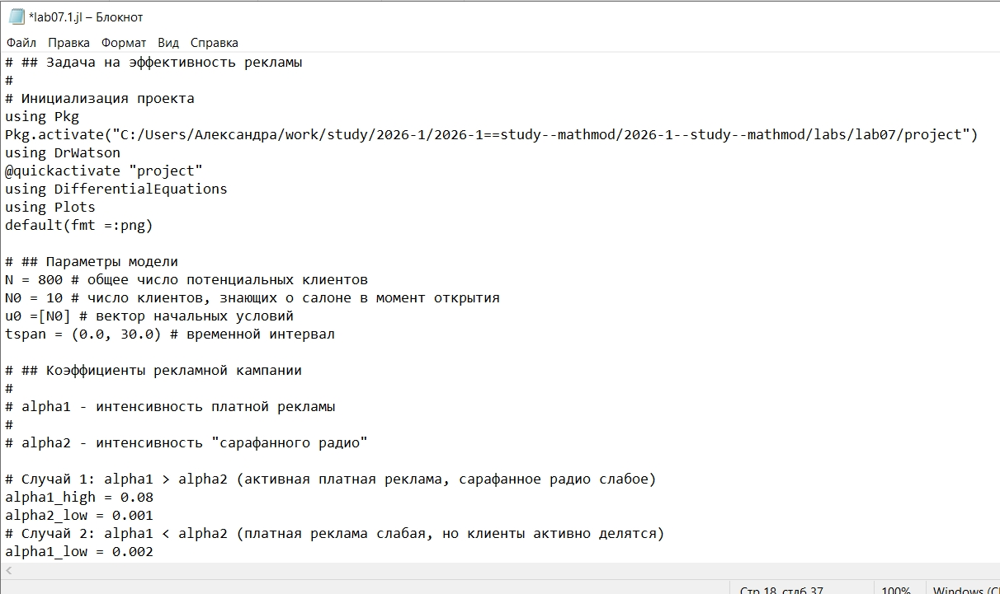
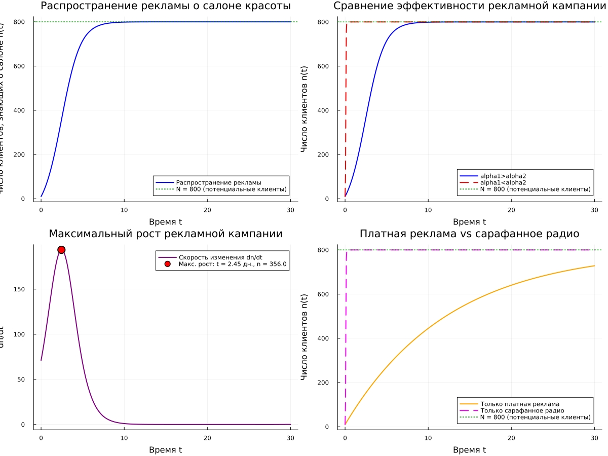
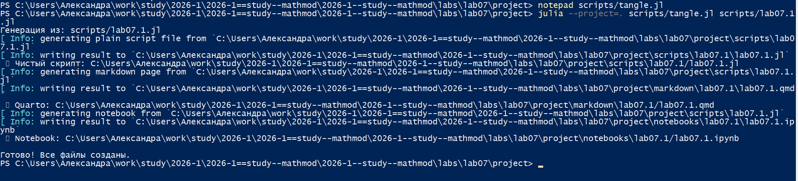
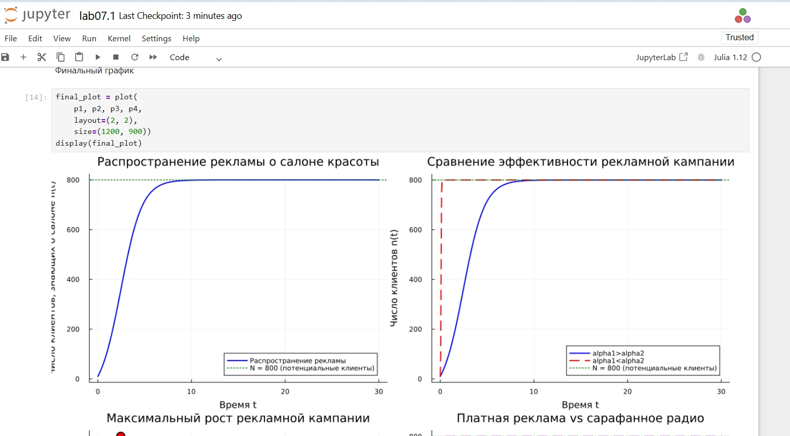
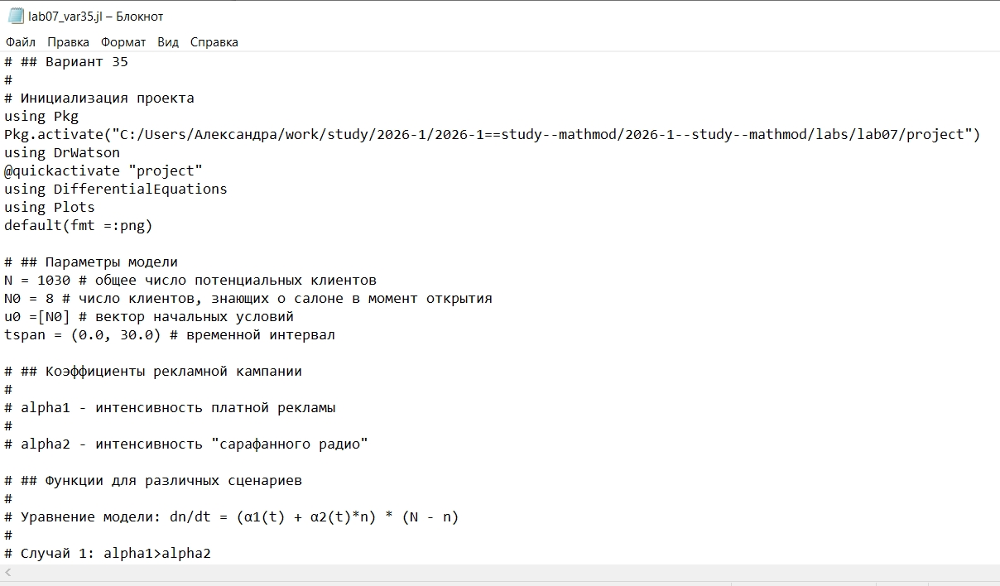
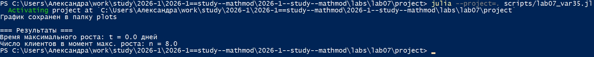

---
## Author
author:
  name: Соколова Александра Олеговна
  degrees: DSc
  orcid: 0000-0002-0877-7063
  email: 1132236034@rudn.ru
  affiliation:
    - name: Российский университет дружбы народов
      country: Российская Федерация
      postal-code: 117198
      city: Москва
      address: ул. Миклухо-Маклая, д. 6

## Title
title: "Отчёт по лабораторной работе №7"
subtitle: "Математическое моделирование"
license: "CC BY"
---

# Цель работы

 Построить график распространения рекламы для различных сценариев рекламной кампании на основе математической модели, описываемой дифференциальным уравнением. Определить момент времени, когда скорость распространения рекламы достигает максимального значения. Освоить методы численного решения дифференциальных уравнений в Julia и визуализации результатов моделирования.

# Задание

Постройте график распространения рекламы, математическая модель которой описывается следующим уравнением:

1. $$ \frac{dn}{dt} = (0.83 + 0.000083 \cdot n(t))(N - n(t)) $$

2. $$ \frac{dn}{dt} = (0.000083 + 0.83 \cdot n(t))(N - n(t)) $$

3. $$ \frac{dn}{dt} = (0.83 \sin(t) + 0.83 \sin(t) \cdot n(t))(N - n(t)) $$

При этом объём аудитории $N = 1030$, в начальный момент о товаре знает $N_0 = 8$ человек. Для случая 2 определите, в какой момент времени скорость распространения рекламы будет иметь максимальное значение.

# Теоретическое введение

## Модель распространения рекламы

В процессе рекламной кампании нового товара или услуги необходимо, чтобы прибыль от будущих продаж с избытком покрывала издержки на рекламу. В начальный период расходы на рекламу могут превышать прибыль, поскольку лишь малая часть потенциальных покупателей информирована о новинке. По мере увеличения числа продаж возрастает и прибыль. В конечном счёте наступает момент насыщения рынка, когда дальнейшая реклама становится неэффективной.

Математическая модель распространения рекламы описывается уравнением:

$$ \frac{dn}{dt} = (\alpha_1(t) + \alpha_2(t) \cdot n(t))(N - n(t)) $$

где:
- $n(t)$ — число потребителей, узнавших о товаре и готовых его купить к моменту времени $t$;
- $N$ — общее число потенциальных платёжеспособных покупателей;
- $\alpha_1(t) > 0$ — коэффициент, характеризующий интенсивность платной рекламы (зависит от затрат на рекламу в данный момент времени);
- $\alpha_2(t) > 0$ — коэффициент, характеризующий интенсивность распространения информации через "сарафанное радио".

Скорость изменения числа знающих о товаре людей пропорциональна как числу знающих о товаре покупателей, так и числу покупателей, о нём не знающих. Первое слагаемое $\alpha_1(t)(N - n(t))$ описывает вклад платной рекламы, второе слагаемое $\alpha_2(t)n(t)(N - n(t))$ описывает вклад "сарафанного радио".

## Частные случаи модели

### Модель Мальтуса

При $\alpha_1(t) \gg \alpha_2(t)$ получается модель типа модели Мальтуса:

$$ \frac{dn}{dt} = \alpha_1(N - n) $$

Решение имеет вид:

$$ n(t) = N - (N - N_0)e^{-\alpha_1 t} $$

### Логистическая кривая

В обратном случае, при $\alpha_1(t) \ll \alpha_2(t)$, получаем уравнение логистической кривой:

$$ \frac{dn}{dt} = \alpha_2 n (N - n) $$

Решение имеет вид:

$$ n(t) = \frac{N}{1 + \frac{N - N_0}{N_0} e^{-\alpha_2 N t}} $$

# Выполнение лабораторной работы

Начинаю выполнение лабораторной с инициализации проекта DrWatson ([рис. @fig-001]).

{#fig-001 width=70%}

Для реализации модели эффективности рекламы создаю файл scripts/lab07.1.jl и записываю туда скрипт ([рис. @fig-002]).

{#fig-002 width=70%}

Запускаю скрипт командой "julia --project=. scripts/lab07.1.jl ([рис. @fig-003]).

{#fig-003 width=70%}

Просматриваю результирующий график в папке "plots" ([рис. @fig-004]).

{#fig-004 width=70%}

Создаю файл tangle.jl для дальнейшей генерации производных форматов ([рис. @fig-005]).

{#fig-005 width=70%}

Генерирую чистый код, jupyter notebook и документацию в формате Quarto с помощью tangle.jl ([рис. @fig-006]).

{#fig-006 width=70%}

Открываю jupyter notebook и проверяю, что все коды успешно запускаются ([рис. @fig-007]).

{#fig-007 width=70%}

Для реализации задания из личного варианта 35 создаю файл scripts/lab07_var35.jl и записываю туда скрипт ([рис. @fig-008]).

{#fig-008 width=70%}

Запускаю скрипт командой "julia --project=. scripts/lab07_var35.jl ([рис. @fig-009]).

{#fig-009 width=70%}

Просматриваю результирующий график в папке "plots" ([рис. @fig-010]).

{#fig-010 width=70%}

Генерирую чистый код, jupyter notebook и документацию в формате Quarto с помощью tangle.jl и выполняю проверку в jupyter notebook ([рис. @fig-011]).

{#fig-011 width=70%}

## Ответы на вопросы к лабораторной работе №7

1. Записать модель Мальтуса (дать пояснение, где используется данная модель)

$$ \frac{dn}{dt} = \alpha_1(N - n) $$

Модель Мальтуса используется в случае доминирования платной рекламы над "сарафанным радио" ($\alpha_1 \gg \alpha_2$), когда скорость распространения информации определяется только рекламными затратами.

2. Записать уравнение логистической кривой (дать пояснение, что описывает данное уравнение)

$$ \frac{dn}{dt} = \alpha_2 n (N - n) $$

Логистическая кривая описывает распространение информации через "сарафанное радио" ($\alpha_1 \ll \alpha_2$), когда скорость роста сначала увеличивается, а затем замедляется по мере насыщения рынка.

3. На что влияет коэффициент $\alpha_1(t)$ и $\alpha_2(t)$ в модели распространения рекламы

- $\alpha_1(t)$ — интенсивность платной рекламы (зависит от затрат на рекламу).
- $\alpha_2(t)$ — интенсивность "сарафанного радио" (зависит от активности потребителей в распространении информации).

4. Как ведёт себя рассматриваемая модель при $\alpha_1(t) \geq \alpha_2(t)$

При $\alpha_1 \geq \alpha_2$ доминирует платная реклама. Кривая роста близка к экспоненциальной, процесс описывается моделью Мальтуса.

5. Как ведёт себя рассматриваемая модель при $\alpha_1(t) \leq \alpha_2(t)$

При $\alpha_1 \leq \alpha_2$ доминирует "сарафанное радио". Кривая роста имеет S-образную форму, процесс описывается логистическим уравнением.





# Выводы

В ходе выполнения лабораторной работы были построены графики распространения рекламы для трёх различных сценариев: при доминировании платной рекламы, при доминировании "сарафанного радио" и при тригонометрических коэффициентах. Определён момент времени, когда скорость распространения рекламы достигает максимального значения для случая 2. Освоены методы численного решения дифференциальных уравнений в Julia и визуализации результатов моделирования распространения рекламы.

# Список литературы{.unnumbered}

1. Королькова А. В., Кулябов Д. С. Математическое моделирование. Практикум : учебное пособие. — М. : РУДН, 2026. — 87 с.

2. DifferentialEquations.jl: Efficient Differential Equation Solving in Julia. — URL: https://diffeq.sciml.ai/stable/ (дата обращения: 04.09.2026).

3. Plots.jl: Powerful convenience for Julia visualizations. — URL: https://docs.juliaplots.org/stable/ (дата обращения: 04.09.2026).

4. DrWatson.jl: Scientific project assistant software. — URL: https://juliadynamics.github.io/DrWatson.jl/stable/ (дата обращения: 04.09.2026).
