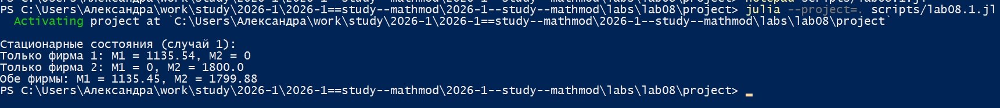
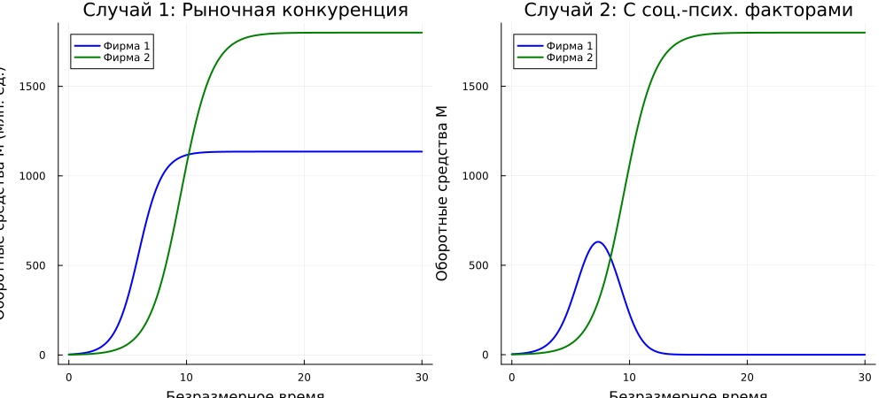
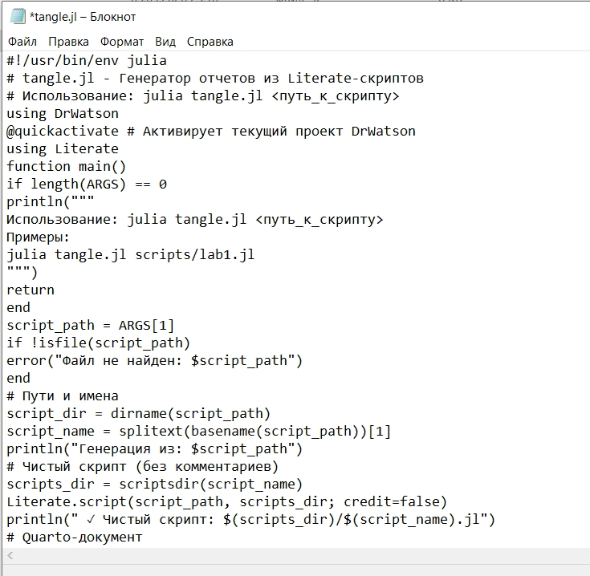
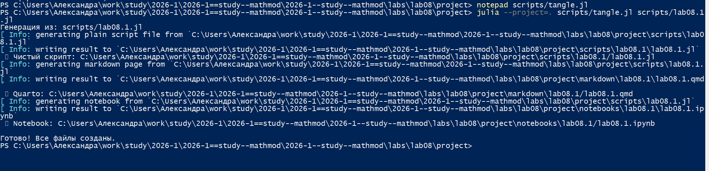
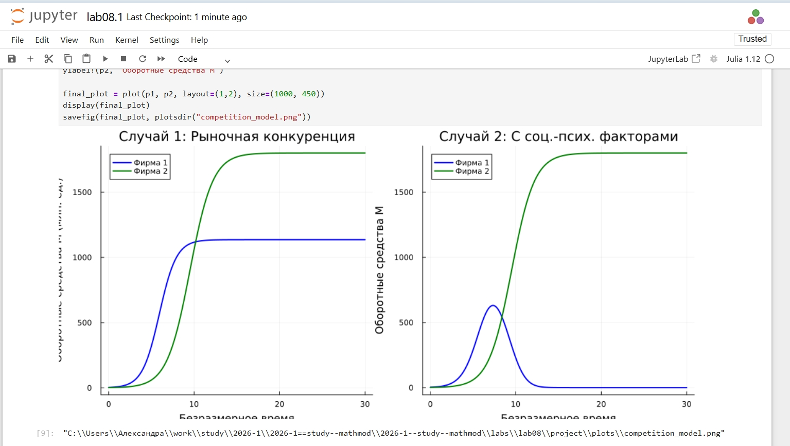
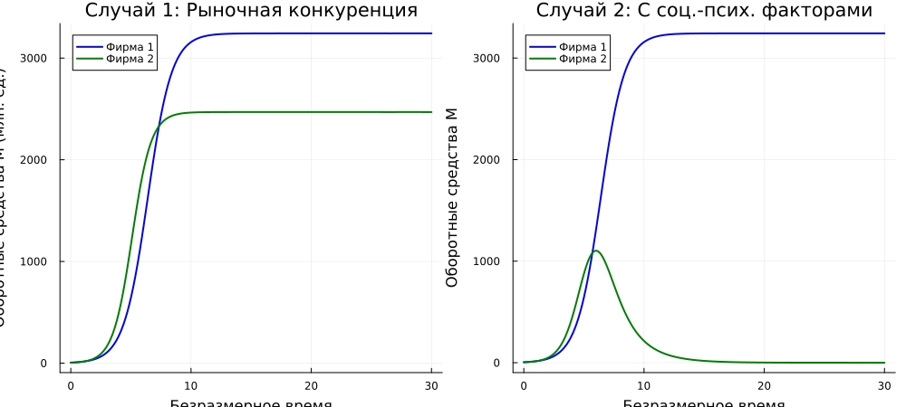
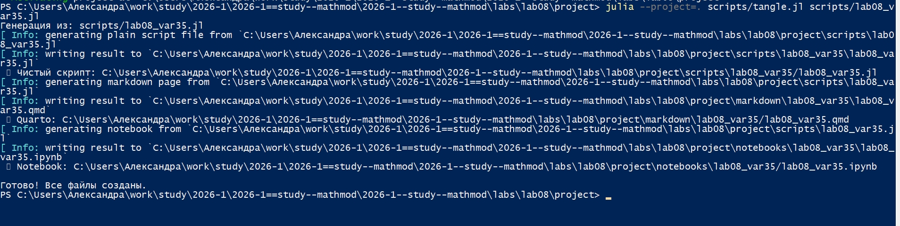

---
## Author
author:
  name: Соколова Александра Олеговна
  degrees: DSc
  orcid: 0000-0002-0877-7063
  email: 1132236034s@rudn.ru
  affiliation:
    - name: Российский университет дружбы народов
      country: Российская Федерация
      postal-code: 117198
      city: Москва
      address: ул. Миклухо-Маклая, д. 6
## Title
title: Презентация по лабораторной работе №8
subtitle: Математическое моделирование
license: CC BY
date: today
date-format: "YYYY-MM-DD" # Example: 2025-09-06
---

## Цель работы

Построить модели конкуренции двух фирм для двух случаев: только рыночная конкуренция и с социально-психологическими факторами. 

## Выполнение лабораторной работы

Начинаю выполнение лабораторной с инициализации проекта DrWatson ([рис. @fig-001]).

{#fig-001 width=70%}

## Модель конкуренции двух фирм

Для реализации модели конкуренции двух фирм создаю файл scripts/lab08.1.jl и записываю туда скрипт ([рис. @fig-002]).

{#fig-002 width=70%}

## Модель конкуренции двух фирм

Запускаю скрипт командой "julia --project=. scripts/lab08.1.jl ([рис. @fig-003]).

{#fig-003 width=70%}

## Модель конкуренции двух фирм

Просматриваю результирующий график в папке "plots" ([рис. @fig-004]).

{#fig-004 width=70%}

## Модель конкуренции двух фирм

Создаю файл tangle.jl для дальнейшей генерации производных форматов ([рис. @fig-005]).

{#fig-005 width=70%}

## Модель конкуренции двух фирм

Генерирую чистый код, jupyter notebook и документацию в формате Quarto с помощью tangle.jl ([рис. @fig-006]).

{#fig-006 width=70%}

## Модель конкуренции двух фирм

Открываю jupyter notebook и проверяю, что все коды успешно запускаются ([рис. @fig-007]).

{#fig-007 width=70%}

## Реализация модели с параметрами варианта 35

Для реализации задания из личного варианта 35 создаю файл scripts/lab08_var35.jl и записываю туда скрипт ([рис. @fig-008]).

{#fig-008 width=70%}

## Реализация модели с параметрами варианта 35

Просматриваю результирующий график в папке "plots" ([рис. @fig-009]).

{#fig-009 width=70%}

## Реализация модели с параметрами варианта 35

Генерирую чистый код, jupyter notebook и документацию в формате Quarto с помощью tangle.jl ([рис. @fig-010]).

{#fig-010 width=70%}

## Реализация модели с параметрами варианта 35

Открываю jupyter notebook и проверяю, что все коды успешно запускаются ([рис. @fig-011]).

{#fig-011 width=70%}

## Выводы

В ходе выполнения лабораторной работы были построены модели конкуренции двух фирм для двух случаев:

Случай 1 (рыночная конкуренция): Обе фирмы достигают устойчивых значений оборотных средств, каждая захватывает свою долю рынка. Конкуренция идёт независимо через изменение параметров производства.

Случай 2 (с социально-психологическими факторами): Добавление коэффициента 0.00053 перед M1M2 для фирмы 2 создаёт асимметрию. Фирма 1, несмотря на начальный рост, терпит банкротство, в то время как фирма 2 остаётся стабильной.

Таким образом, учёт социально-психологических факторов существенно влияет на динамику конкуренции и может привести к вытеснению одной из фирм с рынка, даже если её экономические показатели (себестоимость, время цикла) изначально были конкурентоспособными.