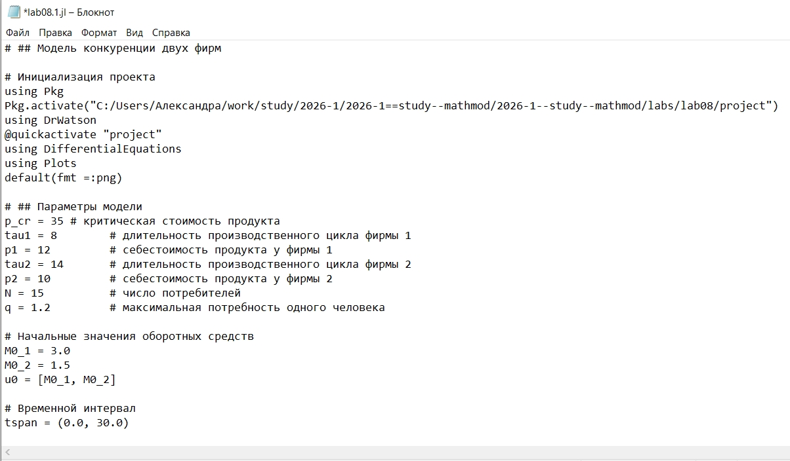
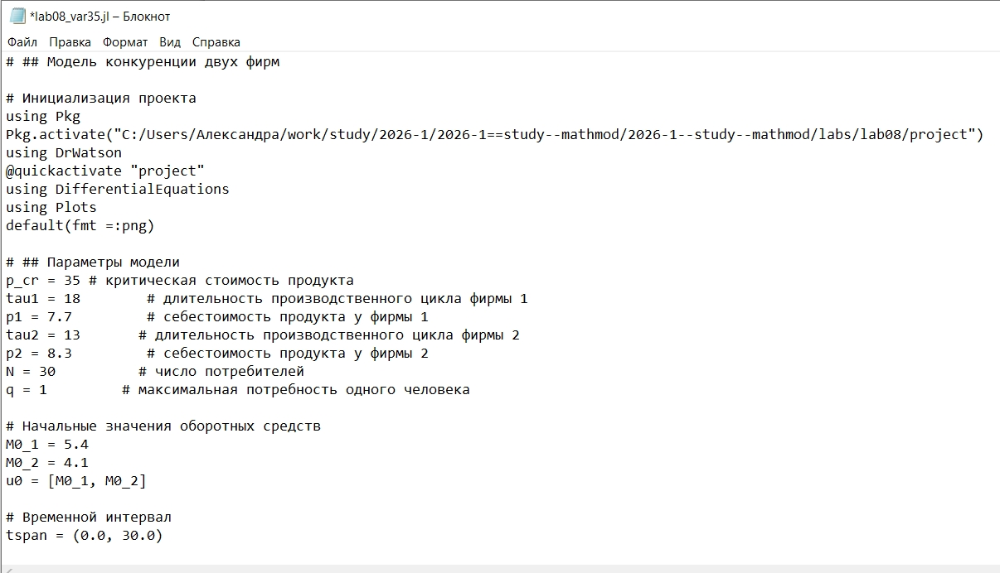
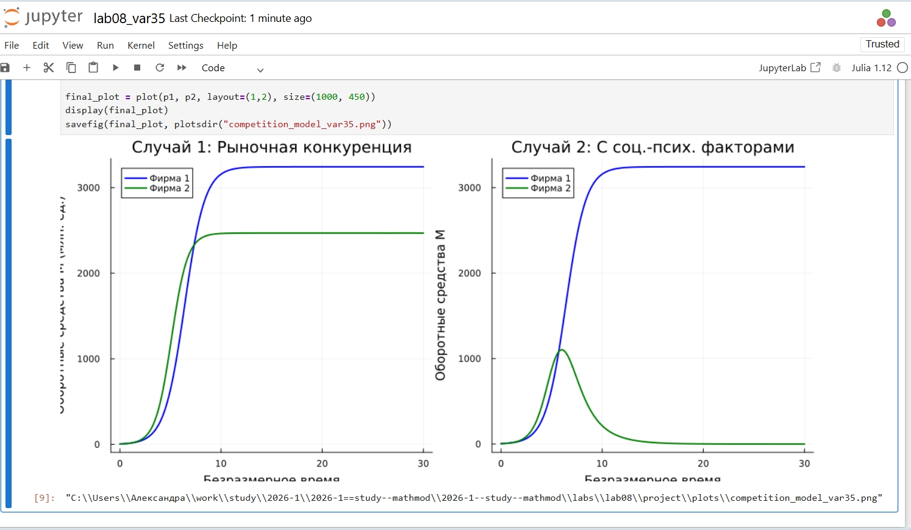

---
## Author
author:
  name: Соколова Александра Олеговна
  degrees: DSc
  orcid: 0000-0002-0877-7063
  email: 1132236034@rudn.ru
  affiliation:
    - name: Российский университет дружбы народов
      country: Российская Федерация
      postal-code: 117198
      city: Москва
      address: ул. Миклухо-Маклая, д. 6

## Title
title: "Отчёт по лабораторной работе №8"
subtitle: "Математическое моделирование"
license: "CC BY"
---

# Цель работы

Построить модели конкуренции двух фирм для двух случаев: только рыночная конкуренция и с социально-психологическими факторами. 

# Задание

1. Придумайте свой пример двух конкурирующих фирм с идентичным
товаром. Задайте начальные значения и известные составляющие. Постройте
графики изменения объемов оборотных средств каждой фирмы. Рассмотрите
два случая.
2. Проанализируйте полученные результаты.
3. Найдите стационарное состояние системы для первого случая.
4. Выполнить задание из собственного варианта(35):

4.1 Построить графики изменения оборотных средств фирмы 1 и фирмы 2 без учета постоянных издержек с введенной нормировкой для случая 1 (только рыночная конкуренция).

4.2 Построить графики изменения оборотных средств фирмы 1 и фирмы 2 без учета постоянных издержек с введенной нормировкой для случая 2 (с социально-психологическими факторами).

**Параметры варианта 35:**

- p_cr = 35 — критическая стоимость продукта
- N = 30 — число потребителей
- q = 1 — максимальная потребность
- tau1 = 18, tau2 = 13 — длительности производственных циклов
- p1 = 7.7, p2 = 8.3 — себестоимости
- M0_1 = 5.4, M0_2 = 4.1 — начальные оборотные средства

**Случай 2:** коэффициент перед M1M2 для фирмы 2: b/c1 + 0.00053.

# Теоретическое введение

## Модель одной фирмы

Рассмотрим фирму, производящую продукт долговременного пользования, цена которого определяется балансом спроса и предложения. Будем считать, что продукт занимает определённую нишу рынка, и конкуренты в ней отсутствуют.

**Обозначения:**

- N — число потребителей
- S — доходы потребителей
- M — оборотные средства предприятия
- tau — длительность производственного цикла
- p — рыночная цена товара
- p̃ — себестоимость продукта
- delta — доля оборотных средств, идущая на покрытие переменных издержек
- kappa — постоянные издержки
- q — максимальная потребность одного человека в продукте в единицу времени

Функция спроса для товаров долговременного использования имеет вид:

Q = q(1 - p/p_cr)

где p_cr = Sq/k — критическая стоимость продукта.

**Динамика оборотных средств** описывается уравнением:

dM/dt = -M*delta/tau + N*Q*p - kappa

где первое слагаемое — затраты на производство, второе — выручка.

**Уравнение для цены:**

dp/dt = gamma*(-M*delta/(tau*p̃) + N*q*(1 - p/p_cr))

При быстром установлении ценового равновесия получаем стационарные значения оборотных средств:

M_+ = N*q*tau/delta*(1 - p̃/p_cr)*p̃

M_- = kappa*p̃*tau/(delta*(p_cr - p̃))

Первое состояние устойчиво и соответствует стабильной работе предприятия, второе — неустойчиво (при M < M_- фирма банкротится).

## Модель конкуренции двух фирм

Рассмотрим две фирмы, производящие взаимозаменяемые товары одинакового качества в одной рыночной нише. Потребители не имеют априорных предпочтений и выбирают товар без внимания к марке.

**Случай 1: рыночная конкуренция**

Конкуренты влияют друг на друга только через изменение параметров производства (себестоимость, время цикла) и не могут прямо вмешиваться в рыночную ситуацию.

Динамика оборотных средств описывается системой:

dM1/dtheta = M1 - (b/c1)*M1*M2 - (a1/c1)*M1^2

dM2/dtheta = (c2/c1)*M2 - (b/c1)*M1*M2 - (a2/c1)*M2^2

где коэффициенты:

a1 = p_cr/(tau1^2 * p1^2 * N * q)

a2 = p_cr/(tau2^2 * p2^2 * N * q)

b = p_cr/(tau1^2 * p1^2 * tau2^2 * p2^2 * N * q)

c1 = (p_cr - p1)/(tau1 * p1)

c2 = (p_cr - p2)/(tau2 * p2)

Здесь theta = t*c1 — безразмерное время.

**Случай 2: с социально-психологическими факторами**

Помимо экономических факторов, используются социально-психологические методы — формирование общественного предпочтения одного товара другому независимо от качества и цены. В этом случае коэффициент перед M1M2 изменяется.

Для варианта 35 система имеет вид:

dM1/dtheta = M1 - (b/c1)*M1*M2 - (a1/c1)*M1^2

dM2/dtheta = (c2/c1)*M2 - (b/c1 + 0.00053)*M1*M2 - (a2/c1)*M2^2

# Выполнение лабораторной работы

Начинаю выполнение лабораторной с инициализации проекта DrWatson ([рис. @fig-001]).

{#fig-001 width=70%}

Для реализации модели конкуренции двух фирм создаю файл scripts/lab08.1.jl и записываю туда скрипт ([рис. @fig-002]).

{#fig-002 width=70%}

Запускаю скрипт командой "julia --project=. scripts/lab08.1.jl ([рис. @fig-003]).

{#fig-003 width=70%}

Просматриваю результирующий график в папке "plots" ([рис. @fig-004]).

{#fig-004 width=70%}

Создаю файл tangle.jl для дальнейшей генерации производных форматов ([рис. @fig-005]).

{#fig-005 width=70%}

Генерирую чистый код, jupyter notebook и документацию в формате Quarto с помощью tangle.jl ([рис. @fig-006]).

{#fig-006 width=70%}

Открываю jupyter notebook и проверяю, что все коды успешно запускаются ([рис. @fig-007]).

{#fig-007 width=70%}

Для реализации задания из личного варианта 35 создаю файл scripts/lab08_var35.jl и записываю туда скрипт ([рис. @fig-008]).

{#fig-008 width=70%}

Просматриваю результирующий график в папке "plots" ([рис. @fig-009]).

{#fig-009 width=70%}

Генерирую чистый код, jupyter notebook и документацию в формате Quarto с помощью tangle.jl ([рис. @fig-010]).

{#fig-010 width=70%}

Открываю jupyter notebook и проверяю, что все коды успешно запускаются ([рис. @fig-011]).

{#fig-011 width=70%}





# Выводы

В ходе выполнения лабораторной работы были построены модели конкуренции двух фирм для двух случаев:

Случай 1 (рыночная конкуренция): Обе фирмы достигают устойчивых значений оборотных средств, каждая захватывает свою долю рынка. Конкуренция идёт независимо через изменение параметров производства.

Случай 2 (с социально-психологическими факторами): Добавление коэффициента 0.00053 перед M1M2 для фирмы 2 создаёт асимметрию. Фирма 1, несмотря на начальный рост, терпит банкротство, в то время как фирма 2 остаётся стабильной.

Таким образом, учёт социально-психологических факторов существенно влияет на динамику конкуренции и может привести к вытеснению одной из фирм с рынка, даже если её экономические показатели (себестоимость, время цикла) изначально были конкурентоспособными.

# Список литературы{.unnumbered}

1. Королькова А. В., Кулябов Д. С. Математическое моделирование. Практикум : учебное пособие. — М. : РУДН, 2026. — 87 с. 

2. DifferentialEquations.jl: Efficient Differential Equation Solving in Julia. — URL: https://diffeq.sciml.ai/stable/  

3. Plots.jl: Powerful convenience for Julia visualizations. — URL: https://docs.juliaplots.org/stable/  

4. DrWatson.jl: Scientific project assistant software. — URL: https://juliadynamics.github.io/DrWatson.jl/stable/ 

5. Копылов А.В., Просвиров А.Э. Динамическая модель конкуренции двух фирм на однородном рынке. — Волгоградский филиал Российского торгово-экономического университета, 2003.